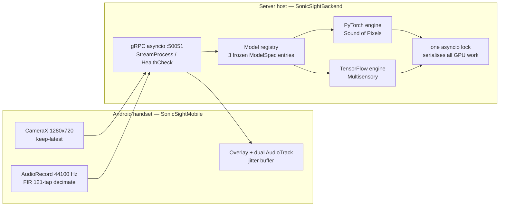

# SonicSight

**Real-time audio-visual source separation on consumer hardware.**

A phone captures camera and microphone together and streams both to a GPU
server over gRPC. The server separates the audio into two tracks and returns a
heatmap showing where in the frame the sound came from. The phone plays the
separated audio and draws the heatmap over the live viewfinder.

Two pre-trained research models sit behind one selection mechanism and share a
single GPU in a single process:

| Model | Framework | Mode | Separates |
|---|---|---|---|
| Sound of Pixels | PyTorch | `halves` | musical instruments, by the left and right halves of the frame |
| Sound of Pixels | PyTorch | `touch` / `pixel` | whatever is in the region you tap |
| Multisensory | TensorFlow | `speech` | on-screen speech from off-screen speech |

This is a **fourth-year software engineering project at the Higher Institute
for Applied Sciences and Technology** — a research case study, not a product.
No model was trained or fine-tuned; both are published checkpoints. There is
no user study, no medical or clinical claim, and no security posture beyond a
trusted local network. See [Scope and limits](#scope-and-limits).

---

## Repositories

This repository is an index. The code lives in three places.

| Repository | Contents |
|---|---|
| **[SonicSightBackend](https://github.com/K1ller-Whale/SonicSightBackend)** | The inference server: gRPC service, model registry, both engine adapters, the session state machine, the load and stress harness, and the deterministic replay harness. Python. |
| **[SonicSightMobile](https://github.com/K1ller-Whale/SonicSightMobile)** | The Android client: capture, pre-processing, transport, jitter buffer, dual-track playback, heatmap overlay, touch interaction. Kotlin, MVVM with a repository layer. |
| **[multisensory](https://github.com/K1ller-Whale/multisensory)** | Fork of [andrewowens/multisensory](https://github.com/andrewowens/multisensory), ported from Python 2 to Python 3 and running under the TensorFlow v1 compatibility layer inside TensorFlow 2.21. The speech engine loads from here. |

---

## Architecture



**Uplink** carries `StreamChunk`: JPEG-encoded frames plus linear PCM blocks.
**Downlink** carries `StreamResult`: two separated audio tracks, a localization
heatmap, a sequence number, an echo of the model id, and server timing fields.

The two networks and the TensorFlow session are loaded **once at process
start** and stay resident, shared by every session. Everything per-session —
the streaming buffer, the overlap-add buffers, the touch window cache, the
cluster state — is created when a channel opens and destroyed when it closes.
That split is what lets two sessions run different models without colliding.

The registry starts **load-tolerantly**: if one engine fails to load, the
server still comes up and serves the models it does have, declaring them
through the health check. The server has been run on a host with no
TensorFlow installed at all.

### How a window becomes sound

1. Phone throttles camera to 8 fps (halves) or ≈30 fps (speech), rotates,
   splits, crops to 224×224, encodes JPEG q90.
2. Phone reads the mic in 5512-sample blocks (125 ms at 44100 Hz), filters and
   decimates to the wire rate.
3. Server selects the newest frame with a full audio window centred on it,
   aligned to the STFT hop.
4. Inference runs under the single GPU lock.
5. Only the **centre hop-length slice** of each output is kept, and stitched
   into the running output by overlap-add with a raised-cosine crossfade.
6. Phone buffers, plays the two tracks panned left and right, and draws the
   heatmap over the viewfinder.

Touch mode adds a cheap path: a region query is answered from the cached
window with no new forward pass, because the mask synthesiser is linear.

---

## How the repositories depend on each other

There are exactly three couplings. Everything else is independent.

### 1. `sonicsight.proto` — the wire contract

Backend and mobile each hold a **byte-identical copy**. Both are generated
from it: Python stubs on the server, Kotlin stubs on the phone.

Any contract change must be made in **both copies in one commit**, then
regenerated on both sides. Identity is verified by SHA-256 comparison, and the
mobile test suite pins the hash so drift fails a test rather than surfacing as
a decoding bug months later.

> Current cross-repo hash: `BA76EAAE…B78005` (observed 2026-08-13). Full value
> to be recorded in [`docs/WIRE_CONTRACT.md`](docs/WIRE_CONTRACT.md).

### 2. Backend → multisensory

The speech engine imports the ported research code from the `multisensory`
repository. **Today the backend reaches this as a sibling directory**, so the
two must be cloned side by side:

```
SonicSight/
├── SonicSightBackend/
├── SonicSightMobile/
└── multisensory/
```

This is the one structural dependency between repositories, and it is the
thing that stops the backend from standing alone. Work to vendor the reached
subset into `SonicSightBackend/vendor/multisensory/` — with provenance and
licence recorded — is planned but not done.

### 3. Checkpoints

Model weights are **not in any repository**; they are too large. Both the
backend and anyone reproducing results provision them separately. See
[Model checkpoints](#model-checkpoints).

The mobile app depends on the backend **only through the wire protocol**. It
does not import backend code and does not need the backend repository present
to build. It does need a reachable server at run time, and its address is set
in-app and persisted across runs.

---

## Model checkpoints

Download and place these before running the server. They are not redistributed
here.

### Multisensory (speech)

<https://andrewowens.com/multisensory/multisensory-nets.zip>

Contains the pretrained network used by the speech engine
(`net.tf-160000`, ≈1.3 GiB unpacked).

### Sound of Pixels (halves and touch)

<https://drive.google.com/drive/folders/1qwi4-iJJVMjdaDoPIBRQcras77Fi5B7w?usp=drive_link>

Three PyTorch checkpoints — the frame network, the sound network, and the
synthesiser — ≈158.8 MiB in total.

Expected layout, exact filenames, and a SHA-256 manifest to verify against are
in [`docs/CHECKPOINTS.md`](docs/CHECKPOINTS.md). **Verify the hashes.** The
locked constants below are tied to these specific checkpoints; a different
checkpoint will run without error and produce nonsense.

---

## Locked constants

These values are frozen in code and deliberately **not** exposed as
configuration. They are not tuning parameters — they are properties of the
trained checkpoints, and changing one produces confident-looking wrong output
rather than an error.

| Concern | Value |
|---|---|
| Mic capture | 44100 Hz, read in 5512-sample blocks (125 ms) |
| Halves decimation | FIR 121-tap, ÷4 → 1378 samples @ 11025 Hz |
| Speech decimation | ÷2 → 22050 Hz on the wire; the engine resamples 21:20 to its internal 21000 Hz |
| Sound of Pixels | STFT 1022/256, window 65536 samples (5.944 s), K = 32 |
| Multisensory | window 44144 samples @ 21000 Hz (2.102 s), hop 250 ms |
| Camera | 1280×720 → 224×224 crops, JPEG q90 |
| Result cadence | halves 8/s (125 ms hop) · speech 4/s (250 ms hop) |
| Heatmap | native 14×14 (touch) or 7×7 (speech), 56×56 on the wire |
| Transport | plaintext gRPC on LAN :50051, keepalive 30 s, 16 MB max message |
| cuDNN workspace | 512 MB default |

The evidence behind each lock — including the mask check that flips from
+0.8248 to +0.0924 when the speech window is doubled — is in the project
report.

---

## Reference results

Measured on **E-M** (WSL2 Ubuntu on Windows 10 Pro, GTX 1660 Ti 6 GiB, Python
3.12, TensorFlow 2.21 GPU, torch 2.11+cu128), one server, no restarts, all
three models resident.

| | halves | speech |
|---|---|---|
| Time to first result (p95) | 6.42 s | 2.77 s |
| Per-window inference (p95) | 60 ms | 154 ms |
| Result cadence deviation (p95) | 0.87–0.96 ms | 1.18 ms |
| Concurrent session ceiling | 3 | 1 |

GPU residency with all three models loaded and idle: **894 MiB**.

Every number carries its measurement environment. The environments are
described in the report appendix and reproduced in
[`docs/ENVIRONMENTS.md`](docs/ENVIRONMENTS.md).

**The central finding of the study** is that perceptual latency — roughly 1.4
to 3 seconds — is imposed by the analysis-window structure of the two models,
not by the engineering around them. Speeding inference to zero would not
change the experience. That places the system two to three orders of
magnitude away from conversational hearing assistance, and identifies the
obstacle as a model-research problem.

---

## Citing the models

This project uses two published models without modification to their trained
weights. If you use this work, cite them.

**Sound of Pixels** — Zhao, H., Gan, C., Rouditchenko, A., Vondrick, C.,
McDermott, J., & Torralba, A. (2018). The Sound of Pixels. *Proceedings of the
European Conference on Computer Vision (ECCV 2018).*

```bibtex
@inproceedings{zhao2018sound,
  title     = {The Sound of Pixels},
  author    = {Zhao, Hang and Gan, Chuang and Rouditchenko, Andrew and
               Vondrick, Carl and McDermott, Josh and Torralba, Antonio},
  booktitle = {Proceedings of the European Conference on Computer Vision (ECCV)},
  year      = {2018}
}
```

**Multisensory** — Owens, A., & Efros, A. A. (2018). Audio-Visual Scene
Analysis with Self-Supervised Multisensory Features. *Proceedings of the
European Conference on Computer Vision (ECCV 2018).* arXiv:1804.03641.

```bibtex
@inproceedings{owens2018audio,
  title     = {Audio-Visual Scene Analysis with Self-Supervised
               Multisensory Features},
  author    = {Owens, Andrew and Efros, Alexei A.},
  booktitle = {Proceedings of the European Conference on Computer Vision (ECCV)},
  year      = {2018},
  eprint    = {1804.03641},
  archivePrefix = {arXiv}
}
```

The datasets behind them are worth citing too when the domain limits matter:
**MUSIC** (introduced in the Sound of Pixels paper), **AudioSet** (Gemmeke et
al., ICASSP 2017) for the Multisensory pretext task, and **VoxCeleb** (Nagrani
et al., Interspeech 2017) for its separation head. The full bibliography — 49
entries covering the models, the signal processing, the frameworks, the
standards, and the audiology literature behind the feasibility verdict — is in
the project report.

Third-party attributions and licence findings are in
[`NOTICES.md`](NOTICES.md).

---

## Scope and limits

Stated plainly, because the project's method depends on not overclaiming:

- **No training.** Both models are published checkpoints, used as published.
- **No user study.** No member of the intended beneficiary group has used the
  system.
- **No medical claim.** This is not a medical device and makes no clinical
  claim.
- **No transport security.** Plaintext gRPC on a trusted LAN — a deliberate,
  declared posture for a lab study, not an oversight.
- **Narrow model domains.** Musical instruments for one model, on-screen
  versus off-screen speech for the other. Performance outside those domains is
  not guaranteed.
- **Coarse localization.** A 14×14 grid and a 7×7 map. The interface says so
  rather than implying more precision than exists.
- **Mobile hardware verification is incomplete.** The client is verified at
  unit level; the device matrix has not been run.

Eight further gaps that a real product would need — and this study
deliberately does not provide — are documented as `FR-P01` through `FR-P08` in
the report.

---

## Documentation map

| Where | What |
|---|---|
| This repository | System overview, cross-repo contract, checkpoints, citations |
| `docs/` here | Wire contract, checkpoints, environments, defect index, reproduction guide |
| SonicSightBackend `docs/` | Architecture decision records, measurement results, validation records, NFR targets |
| SonicSightMobile `docs/` | Test plan and report, defect ledger, seams, device matrix, run instructions |

---

## Team

Jaafer Mahfoud · Hatem Ibrahim
Supervised by Dr. Mustafa Daqqaq and Eng. Marah Hassan
Higher Institute for Applied Sciences and Technology — Software Engineering
and Artificial Intelligence, 2025–2026
