# SonicSight: A Real-Time Audio-Visual Source Separation System

### Technical Report

---

<!-- ─────────────────────────────────────────────────────────────────────────
     PLACEHOLDER — TO BE COMPLETED BY THE PROJECT TEAM
     No course, institution, supervisor, or submission date was supplied, and
     none is recorded anywhere in the three repositories. Nothing has been
     invented. Fill the table below before submission.
     ───────────────────────────────────────────────────────────────────── -->

| Field | Value |
|---|---|
| Course | *(to be completed)* |
| Institution | *(to be completed)* |
| Supervisor | *(to be completed)* |
| Submission date | *(to be completed)* |
| Report prepared from repository state of | 2026-08-05 |

**Repository heads this report documents**

| Repository | Branch | Head commit | Date | Working tree |
|---|---|---|---|---|
| `SonicSightBackend` | `main` | `9da8709` | 2026-08-05 | clean |
| `SonicSightMobile` | `master` | `cfbe64f` | 2026-08-05 | clean |
| `multisensory` | `master` | `424b85b` | 2026-08-04 | clean |

Every statement in this report was verified against those three working trees.
Where existing project documentation contradicts the code, the code is followed
and the contradiction is recorded (Section 11.6).

<!-- ─────────────────────────────────────────────────────────────────────────
     PLACEHOLDER — TEAM MEMBERS AND CONTRIBUTION SPLIT
     No team roster or contribution split was supplied. The repositories record
     exactly one personal name (an "Owner" field in the project handoff
     document); a single name is not a contribution split, and inventing one
     would be worse than leaving this blank. Fill it in before submission.
     ───────────────────────────────────────────────────────────────────── -->

**Team members and contribution split**

| Member | Role | Contribution |
|---|---|---|
| *(to be completed)* | *(to be completed)* | *(to be completed)* |
| *(to be completed)* | *(to be completed)* | *(to be completed)* |
| *(to be completed)* | *(to be completed)* | *(to be completed)* |

---

## Contents

1. [Introduction](#1-introduction)
2. [Background and related work](#2-background-and-related-work)
3. [System overview](#3-system-overview)
4. [Backend architecture](#4-backend-architecture)
5. [Mobile architecture](#5-mobile-architecture)
6. [Communication protocol](#6-communication-protocol)
7. [The processing pipeline](#7-the-processing-pipeline)
8. [Model integration](#8-model-integration)
9. [Latency and performance](#9-latency-and-performance)
10. [Validation](#10-validation)
11. [Limitations and known issues](#11-limitations-and-known-issues)
12. [Security and privacy considerations](#12-security-and-privacy-considerations)
13. [Future work](#13-future-work)
14. [Development tooling and environment](#14-development-tooling-and-environment)
15. [Attribution and licensing](#15-attribution-and-licensing)
16. [Conclusion](#16-conclusion)
- [References](#references)
- [Appendix A — Traceability](#appendix-a--traceability)
- [Appendix B — Complete protocol source](#appendix-b--complete-protocol-source)
- [Appendix C — Configuration reference](#appendix-c--configuration-reference)
- [Appendix D — Glossary](#appendix-d--glossary)

**Figures.** 1 system context (§3.3) · 2 backend architecture (§4.1) ·
3 backend module graph (§4.7) · 4 mobile architecture (§5.1) ·
5 mobile threading (§5.7) · 6–9 interaction sequences (§6.6) ·
10a–10c end-to-end pipeline (§7.1, §7.3, §7.4) · 11 timing and latency (§9.1) ·
12 stream lifecycle (§14.3).

**Tables.** 1 capability status · 2 model comparison · 3 repositories ·
4 listening modes · 5 backend layers · 6 model specification ·
7 environment variables · 8 locked constants · 9 field population ·
10 comment-versus-code divergences · 11 pipeline stages · 12 latency budget ·
13 measured inference latency · 14 video memory · 15 backend dependencies ·
16 Android toolchain · 17 multisensory environment · 18 documentation machine.

---

## 1. Introduction

### 1.1 Problem statement

A microphone records a sum. When two instruments play together, or a person
speaks while a television plays behind them, the pressure wave arriving at a
single microphone is one signal in which every source is already added
together. Recovering the individual sources from that sum is the *source
separation* problem, and with one microphone it is underdetermined: there are
more unknowns than measurements, and infinitely many decompositions of the
mixture reproduce it exactly.

A camera pointed at the same scene supplies the missing constraint. The image
does not contain the sound, but it contains evidence about which sounds ought
to be present and where they originate: a violin in the left half of the frame
is a reason to expect violin-like time-frequency structure, and a mouth moving
in synchrony with an audio track is a reason to attribute that track to the
person on screen. Systems that exploit this are called *audio-visual source
separation* systems. They convert an underdetermined audio problem into a
better-posed multimodal one.

SonicSight is an application of this idea to a live handheld device. The user
points a phone at a scene; the phone streams camera frames and microphone audio
to a server; the server returns separated audio tracks together with a spatial
map showing which parts of the image the sound is being attributed to; the
phone plays the separated audio and draws the map over the live camera preview.
The intended experience is being able to *hear* a chosen part of what one is
looking at.

### 1.2 Motivation

Three properties distinguish this project from a batch re-implementation of a
research paper.

**It is live.** The separation runs continuously on a stream, not once on a
finished file. That forces engineering that a paper does not have to do:
windowing a signal that has no end, stitching independently estimated windows
back into a continuous waveform without audible seams, and holding a latency
budget while doing it.

**It is on a phone.** The capture device is a consumer handset with a single
microphone, an automatic-gain-control audio pipeline, and a camera whose
geometry does not match what any of these networks were trained on. A large
part of the system is the correction of that mismatch.

**It hosts more than one model.** Two published architectures with
incompatible input requirements are served from one process behind one
protocol, selectable per stream. Section 2 explains why neither model alone is
sufficient: one separates musical instruments by image region, the other
separates on-screen speech from off-screen sound, and their domains barely
overlap.

### 1.3 Scope

In scope, and documented here:

- The Android client: capture, transformation, transport, playback, overlay.
- The Python server: transport, buffering, windowing, model dispatch,
  reconstruction.
- Two pretrained neural models and the third mode built on one of them.
- The wire protocol between client and server.
- The measurement record that exists, and the measurements that do not.

Out of scope, and stated plainly rather than implied:

- **No model was trained by this project.** Both checkpoints are pretrained
  artefacts from published research (Section 15). No training code was run, no
  dataset was collected, and no fine-tuning was performed.
- No formal user study was conducted.
- No evaluation against a labelled separation benchmark was performed; the
  system reports no signal-to-distortion-ratio numbers of its own
  (Section 10.6).

### 1.4 Status taxonomy

This report describes a system in which some parts have been run and measured,
some have been built but never exercised under the conditions they were
designed for, and some exist only as plans. Conflating those three states is
the fastest way to make a technical document untrustworthy, so every capability
described in this report carries exactly one of three labels:

- **Implemented and validated** — the code runs and there is a recorded
  measurement or test result.
- **Implemented, not validated** — the code exists and builds, but has not
  been run end to end under the conditions described.
- **Designed, not implemented** — a plan exists, no code.

Table 1 assigns a label to every capability in the system. Sections 4 to 13
elaborate; Section 10 gives the validation detail and Section 11 the
limitations.

**Table 1 — Capability status as of the documented repository heads.**

| # | Capability | Status | Basis for the label |
|---|---|---|---|
| 1 | Sound of Pixels streaming separation, left/right halves | Implemented and validated | Runs end to end; measured effects of mask renormalisation and input-level normalisation are recorded on two clips, and a deterministic file-replay harness exists. Conditions for those measurements (hardware, date) are **not** recorded. |
| 2 | Sound of Pixels one-shot file separation (`ProcessVideo` and the REST `/predict` endpoint) | Implemented, not validated | Code path complete; the only automated test asserts output structure and shapes, not separation quality. |
| 3 | Multisensory model itself: on-screen/off-screen separation plus its class activation map | Implemented and validated | Latency, a designed-to-fail localization cross-check, and CPU/GPU numerical equivalence were all measured on a GTX 1660 Ti under WSL2, recorded 2026-08-03 (Section 10.3). |
| 4 | Multisensory backend engine adapter (the wiring of item 3 into this server) | Implemented, not validated | Its own test plan states the model-in-the-loop comparison against the validated probe has never been run. TensorFlow is not installed on the machine this report was prepared on. |
| 5 | Model registry and per-stream model selection | Implemented, not validated | 13 unit tests over the registry constants and the selection branch pass; the end-to-end switch on a device, and the promise that the refactor left Sound of Pixels numerically unchanged, have not been gated. |
| 6 | Pixel (touch) mode: per-window feature cache, region synthesis, native-resolution energy map | Implemented, not validated | 18 unit tests over the cache, region math and ring pass; a live session on 2026-08-05 produced calibration constants now in the code, so the path has demonstrably run — but none of the numeric gates in the test plan (query-versus-reference, timing, memory) have been executed. |
| 7 | Source discovery: silence gate, clustering, colour persistence | Implemented, not validated | 12 unit tests pass; the silence and match thresholds are explicitly marked provisional in the code and carry a first calibration from one live session. |
| 8 | Both models resident on one GPU in one process | Implemented, not validated | The code loads every registered engine into one process; the video memory footprint with both frameworks resident has never been measured. The published 1870 MiB figure was taken with the TensorFlow model alone. |
| 9 | Transport security and endpoint authentication | Not present | The channel is plaintext and unauthenticated by construction (Section 12). This is a deliberate posture, not an unfinished feature. |
| 10 | Region modes beyond a disc: thirds, quadrants, freeform selection | Designed, not implemented | Named as natural extensions in the model documentation and explicitly deferred. |
| 11 | Principal-component ambient colour layer | Designed, not implemented | Noted as an extension in the pixel-mode design record. |
| 12 | PyTorch port of the multisensory model | Designed, not implemented | A port skeleton exists in the upstream repository with no checkpoint of any kind; the server deliberately uses the TensorFlow path that carries the measurement record. |

Two entries in Table 1 correct project documentation that is now stale:

- Item 6 is labelled from the code. An earlier project brief describes pixel
  mode as a Phase 0 plan with no implementation. That was true when the plan
  was written and is not true of the repositories documented here: the mode
  ships as a registered model id with a server loop, a cache module, a
  clustering module, protocol fields, and an Android touch interface.
- Item 3 is separated from item 4 on purpose. The multisensory *model* is the
  most thoroughly validated component in the project. The *adapter that
  connects it to this server* is among the least.

### 1.5 How to read this report

Section 2 supplies the theory needed to follow the rest, including a
self-contained account of both papers the system is built on. Section 3 orients
the reader: what the software does, what the three repositories contain, and
how they are deployed. Sections 4 and 5 describe the server and the client.
Section 6 specifies the protocol between them. Section 7 is the centre of the
report: one window of data followed from photon and pressure wave to audible
output, with every intermediate shape and rate. Section 8 covers how each model
is wired in and why certain constants must not be changed. Section 9 decomposes
latency. Sections 10 and 11 state what has been proven and what has not.
Sections 12 to 15 cover privacy, planned work, tooling, and attribution.

Appendix A maps every architectural claim in the body to a file and line, so
the body can be read as prose and still be checked. Appendix B reproduces the
protocol definition, Appendix C every configuration constant, and Appendix D
defines the terminology.

---

## 2. Background and related work

### 2.1 Why the mixture is ambiguous from audio alone

Let a microphone observe a signal *x*(*t*) that is the sum of *N* source
signals. Single-channel separation asks for the *N* sources given only their
sum. Without further assumptions the problem has no unique answer: any
partition of the mixture into *N* parts that re-sums correctly is consistent
with the observation.

Classical approaches supply the missing assumption from the statistics of
sound: harmonic structure, temporal continuity, learned spectral templates for
known instruments. These work when the sources are spectrally distinct and fail
when they are not — two violins, or two voices with similar pitch, present
almost identical evidence to an audio-only model.

Vision supplies a different kind of evidence, and crucially an evidence that is
*independent* of the acoustic ambiguity:

- **Identity.** A visible instrument tells the model what class of spectral
  structure to expect, without needing to infer it from the mixture.
- **Position.** A visible source can be associated with a location in the
  image, which lets the separation be *addressed* by region rather than by
  audio characteristics.
- **Synchrony.** Motion that co-varies with the audio over time — lips,
  bow strokes, a struck drum head — is strong evidence that a particular
  visible object is producing a particular part of the sound, and equally
  strong evidence that some part of the sound is *not* produced by anything on
  screen.

The two papers this project builds on use the first two and the third
respectively, and that difference is why the system hosts both.

### 2.2 Time-frequency masking

Both models, and both of this system's separation paths, operate by masking a
time-frequency representation rather than by generating a waveform directly.
The mechanism is worth stating once because every later section depends on it.

A waveform is converted to a **short-time Fourier transform (STFT)** — the
signal is cut into overlapping frames, each frame is windowed and Fourier
transformed, and the result is a complex-valued matrix indexed by frequency bin
and time frame. Each entry is a **time-frequency (T-F)** bin, carrying a
magnitude and a phase.

Separation is then predicted as a **mask**: a matrix the same shape as the
spectrogram, whose entries say how much of each T-F bin belongs to a given
source. Two mask families appear in this report:

- A **ratio mask** takes continuous values, usually in the interval from zero
  to one, and scales each bin.
- A **binary mask** takes only the values zero and one, assigning each bin
  wholly to one source or to none.

The estimated source is reconstructed by multiplying the mixture magnitude by
the mask, re-attaching the mixture's original phase, and applying the
**inverse short-time Fourier transform (ISTFT)** to return to a waveform.
Reusing the mixture phase is standard practice and is an approximation:
the phase of the mixture is not the phase of the source, and the residual error
this introduces is one of the reasons masking-based separation sounds
characteristically "phasey" when sources overlap heavily.

Masking has one property that matters for the architecture of this system: if
the masks for all sources sum to one at every bin, the separated outputs sum
back to the mixture exactly. Separation then becomes a *partition* of the
observed energy rather than an arbitrary set of estimates. Section 7 shows
where this system enforces that property and Section 8 why.

Separation quality is conventionally reported with three decibel measures
introduced by the BSS-EVAL toolkit: the **signal-to-distortion ratio (SDR)**,
the **signal-to-interference ratio (SIR)**, and the **signal-to-artefacts ratio
(SAR)**. SDR is the headline aggregate; SIR isolates leakage from the other
sources; SAR isolates artefacts introduced by the method itself. Where this
report quotes such figures they come from the published papers, not from
measurements made by this project (Section 10.6).

### 2.3 Sound of Pixels

Zhao, Gan, Rouditchenko, Vondrick, McDermott and Torralba introduced the Sound
of Pixels system at ECCV 2018 [1]. It separates a mixture of musical
instruments and, at the same time, localizes each separated sound in the image.

**Architecture.** Three networks cooperate.

1. A **video analysis network** — a dilated ResNet-18 — maps each input frame
   to a spatial grid of feature vectors. Dilation is used instead of the final
   stride reductions so that the output grid stays reasonably fine; each grid
   cell carries a *K*-dimensional descriptor of the image region it covers. The
   per-frame grids are pooled over time to a single grid of visual features.
2. An **audio analysis network** — a U-Net, an encoder-decoder with skip
   connections between corresponding resolutions — maps the mixture
   spectrogram to *K* feature maps at spectrogram resolution. Each of the *K*
   channels can be read as one learned "sound component" spread over
   time-frequency space.
3. An **audio synthesizer network** combines a visual feature vector with the
   *K* audio feature maps to produce a mask for that visual region.

**Self-supervision by Mix-and-Separate.** The training signal is generated
rather than annotated. Two videos are drawn from the dataset and their audio
tracks are added together to form an artificial mixture. The network is asked
to recover each original track given the mixture and that track's own video.
Because the individual tracks are known by construction, a supervised loss is
available without any human labelling the mixture. This is the central trick of
the paper: it manufactures ground truth for a problem that has none.

**The linear synthesizer, and why it makes per-region querying trivial.** The
synthesizer is a plain inner product. Writing *i* for the *K*-dimensional
visual vector, *s* for the *K* audio feature maps, *α* for a learned per-channel
scale and *b* for a learned scalar bias, the mask logit at time-frequency bin
(*u*, *v*) is

> *z*(*u*, *v*) = Σ<sub>k</sub> α<sub>k</sub> · *i*<sub>k</sub> · *s*<sub>k</sub>(*u*, *v*) + *b*

followed by a sigmoid. The consequence is structural rather than cosmetic. The
expensive parts of the computation — the U-Net over the spectrogram and the
ResNet over the frames — depend only on the *audio* and the *image*, not on
which region is being asked about. The only thing that changes between one
region and another is the *K*-vector *i*. Producing the mask for a different
region is therefore a single small matrix product against feature maps that
have already been computed.

Two capabilities fall straight out of that. First, the paper's per-pixel
localization: evaluate the synthesizer at *every* grid cell in one batched
operation and reduce each resulting mask to a scalar, and the result is a map
of how much sound each image region claims. Second — and this is what
SonicSight's touch mode is built on — a user can point at an arbitrary place in
the image *after* the networks have run, and get that place's audio for the
cost of one inner product and one ISTFT. If the synthesizer were a
multi-layer network taking the visual vector as input, this would still be
possible but would cost a forward pass per query; because it is linear, the
per-query cost is negligible compared with the per-window cost. Section 4.6 and
Section 8.4 describe how the system exploits this.

**Domain.** The model is trained on the paper's MUSIC dataset: untrimmed
video of musical solos and duets collected from a video-sharing site, spanning
eleven instrument categories. Its competence is therefore musical instruments
seen playing, and its localization is *by image region*, driven by appearance
and by which regions explain which parts of the spectrogram.

### 2.4 Multisensory features

Owens and Efros introduced self-supervised multisensory features at ECCV
2018 [2]. The problem it addresses is different: separating the sound made by
things visible on screen from sound whose source is not visible.

**Early fusion.** Rather than processing the two modalities in separate towers
and combining them at the end, the network fuses audio and video early, so that
subsequent layers compute over a joint representation. The paper's argument is
that the relationship being learned — temporal correspondence between a
waveform and a moving image — is not available to a network that only compares
high-level summaries.

**The pretext task.** The self-supervised objective is *temporal alignment*:
the network is shown a video clip and an audio track and must decide whether
the audio is the clip's own audio, correctly aligned, or the same audio shifted
in time by a few seconds. Nothing is labelled. Solving this task requires
representing exactly the synchrony evidence described in Section 2.1, which is
why the resulting features transfer to localization and separation. The paper
reports alignment accuracy well above chance but below human performance on the
same task.

**Pretraining data.** The alignment task is trained on a large collection of
unlabelled videos drawn from AudioSet, at a scale (hundreds of thousands of
clips) that would be infeasible to annotate.

**Localization via class activation mapping.** The network produces an
alignment score for a clip. A **class activation map (CAM)** turns that scalar
into a spatial map: instead of pooling the final convolutional features to a
vector and then classifying, the classifier is applied convolutionally to the
un-pooled features, producing a score at every spatial and temporal position.
Positions with high score are those whose local evidence pushes the network
towards "this audio matches this video". Because the head being visualized is
the *alignment* head, the resulting map has an unusual and important property,
returned to in Section 8.3: a map that is negative everywhere is not a failure
of localization, it is a confident assertion that the audio does not match
anything on screen.

**The separation head.** For on-screen/off-screen separation, a u-net-style
separation head is added on top of the pretrained multisensory features and
fine-tuned on VoxCeleb, a dataset of speech video. The result separates a
visible speaker's voice from off-screen sound. Its competence is therefore
*speech*, and its localization is *by audio-visual correspondence* rather than
by appearance.

### 2.5 Comparison

The two models are not competing implementations of the same capability. They
answer different questions, on different data, with different notions of
"where".

**Table 2 — What each model separates, and what its spatial map means.**

| | Sound of Pixels [1] | Multisensory [2] |
|---|---|---|
| Separates | One audio track per queried image region | On-screen sound from off-screen sound |
| Number of outputs in this system | Two (left half, right half), or one region and its complement in touch mode | Two (on-screen, off-screen) |
| Spatial map means | How strongly each image region claims the sound | How strongly each position supports "this audio matches this video" |
| Native spatial map resolution in this system | 14 × 14 grid | 7 × 7 grid, over 8 time steps |
| Self-supervision | Mix-and-Separate: artificial mixtures of two clips | Temporal alignment: real versus time-shifted audio |
| Training domain of the shipped checkpoint | MUSIC — musical solos and duets, eleven instrument categories | AudioSet for the features; VoxCeleb speech for the separation head |
| Strongest on | Visible musical instruments | A visible person speaking |
| Weakest on | Sources that are not visibly playing, or not in the training vocabulary | Non-speech mixtures; the separation head was never fine-tuned on music |
| Better choice when | The user wants to pick a *place* in a scene and hear it | The user wants a speaker's voice pulled out of a noisy or contaminated recording |
| Failure signature | Two visually similar regions produce similar masks, and the separation degenerates towards an even split | The alignment map collapses to all-negative when nothing on screen explains the audio |

The right-hand column's last row is the reason the system reports a confidence
value on that branch and withholds the map when it is low (Section 8.3): the
multisensory model has a well-defined way of saying "I cannot localize this",
and the interface is built to pass that answer through honestly rather than
render a meaningless overlay.

### 2.6 Design consequence

Because the two models' domains barely overlap — instruments versus speech —
combining their outputs would require deciding, per scene, which one to
believe. No such decision procedure was available that could be justified from
measurement. The system therefore does not fuse, gate, ensemble, or blend the
two models. It presents them as a user-visible choice and runs exactly one of
them per stream. Section 3.4 states the engineering consequences of that
decision.

---

## 3. System overview

### 3.1 What the software does, end to end

The user opens the application, chooses one of three listening modes, and
presses a button. From that moment:

1. The phone captures camera frames and microphone audio continuously.
2. Each frame is transformed into the exact input geometry the selected model
   expects and compressed to JPEG. Each block of audio is filtered and
   decimated to the selected model's wire sample rate and packed as 16-bit
   **pulse-code-modulated (PCM)** samples.
3. Frames and audio are sent to the server as a continuous stream of protocol
   messages over **gRPC**, a remote-procedure-call framework that runs over
   HTTP/2 and supports bidirectional streaming.
4. The server accumulates audio and frames into a rolling buffer. Whenever a
   complete analysis window is available and enough of the timeline has
   advanced since the last one, it extracts that window and runs the selected
   model on it.
5. The model returns separated audio for the whole window plus a spatial map.
   The server extracts the centre slice of each window and stitches consecutive
   slices into a continuous waveform, then sends that slice and the quantized
   map back down the same stream.
6. The phone feeds the returned audio into a jitter buffer that absorbs network
   variability and plays it, and draws the returned map over the live camera
   preview.

In touch mode the loop gains a second, much cheaper path: the phone can send a
spatial query at any moment, and the server answers it from cached intermediate
tensors without running a network at all.

### 3.2 The three repositories

**Table 3 — Repository roles.**

| Repository | Language and runtime | Contains |
|---|---|---|
| `SonicSightBackend` | Python 3.11+, PyTorch, FastAPI, gRPC | The inference server. Transport layer, streaming buffer, overlap-add reconstruction, model registry, engine adapters, the Sound of Pixels network definitions, the pixel-mode cache and clustering, the protocol definition, the deterministic replay harness, and the unit-test suite. Also holds the three PyTorch checkpoints. |
| `SonicSightMobile` | Kotlin, Android, Gradle | The Android client. Capture, image and audio transformation, gRPC client, jitter buffer, overlay rendering, touch interaction, and a byte-identical copy of the protocol definition from which the Kotlin stubs are generated. |
| `multisensory` | Python, TensorFlow 1.x through the version-2 compatibility layer | A vendored copy of the published multisensory research code, migrated from Python 2 to Python 3, with project-specific patches: the class-activation-map tap, a configurable session, a cuDNN workspace cap, and lazy imports so that the inference server does not drag in a plotting stack. Also holds the TensorFlow checkpoints and the diagnostic and analysis tooling built around them. |

The three repositories are siblings under one parent directory. The backend
locates the multisensory checkout by that relative position unless an
environment variable overrides it.

### 3.3 Deployment topology

Figure 1 shows the deployment as it actually is. The phone and the server sit
on the same local network. The server process hosts both frameworks — PyTorch
and TensorFlow — deliberately in one operating-system process, so that the
two CUDA runtime contexts and their kernel images are paid for once rather than
twice; on a six-gigabyte card that decision is the difference between both
models fitting and not. Two network services are exposed: the gRPC service on
port 50051, which carries the entire live path, and a FastAPI service on port
8000 which offers a one-shot file-upload endpoint for the Sound of Pixels model
only.

The transport is plaintext and the endpoint performs no client
authentication. That is stated here rather than deferred because it defines the
trust boundary that Section 12 analyses: everything inside the local network is
trusted, and camera and microphone data cross that boundary in the clear.

**Figure 1 — System context.** The phone captures, the server infers, and the
GPU is shared by both engines inside a single process. The dashed region is the
trust boundary: media leaves the device unencrypted and unauthenticated.

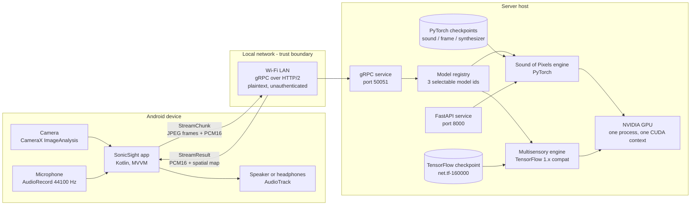

There is one deployment consequence of the single-process rule that the report
must not gloss over. TensorFlow has had no native GPU support on Windows since
version 2.11, and the validated multisensory path runs under the Windows
Subsystem for Linux. One process holding both models therefore means the entire
gRPC server moves into that subsystem, which in turn means the phone cannot
reach it on the local network without either mirrored networking or an explicit
port-forwarding rule. This configuration is **implemented, not validated**: it
has never been exercised with both models resident (Table 1, item 8).

### 3.4 Switchable models, not fused models

The central architectural decision is that the two models are *selectable*, not
combined. Its consequences run through the whole system:

- **Selection is per stream, not per message.** The client names the model it
  wants in the call metadata when it opens the stream. The server resolves that
  name against a registry and configures every per-stream object — the audio
  buffer length, the frame-selection rule, the overlap-add hop — from the
  matching specification.
- **Switching means cancelling and reopening.** The two models require
  different frame rates, different audio sample rates, and differently shaped
  frames; nothing about a half-filled buffer for one model is reusable for the
  other. The client therefore tears the stream down and opens a new one.
- **Every result echoes the model that produced it.** After a switch, results
  computed by the previous model are still in flight. The client discards any
  result whose echoed identifier does not match its current selection, which
  removes the need for any other staleness mechanism.
- **Every per-model constant lives in one frozen specification object.** The
  registry entries are deliberately not configuration keys, environment
  variables, or command-line flags. Section 8.2 explains the evidence behind
  that hostility to knobs: on this project, "reasonable" changes to window
  length and map resolution both produced output that was confident,
  plausible-looking, and wrong.
- **Both models stay resident.** Nothing is unloaded on a switch, so switching
  costs a stream restart rather than a checkpoint reload. The video-memory
  budget that makes this possible is measured for one model and unmeasured for
  both together.

Adding a model is consequently a registry entry plus an engine adapter on the
server and a mirrored profile on the client, and — only if the new model needs
a capture format that does not already exist — a protocol addition.

### 3.5 The three listening modes as deployed

The registry currently holds three entries. Two of them run the same networks
and the same checkpoint and differ only in how the scene is divided.

**Table 4 — The three selectable modes.**

| Model identifier | Shown to the user as | Model | Scene division | The two audio outputs mean | Spatial payload |
|---|---|---|---|---|---|
| `sonicsight` | Music & Instruments | Sound of Pixels | Frame split down the middle into two independently cropped halves | Left half, right half | Two square maps |
| `sonicsight-pixel` | Touch | Sound of Pixels, same checkpoint | Whole letterboxed frame; the user's touch selects a region | Selection, everything else | One map at the model's native grid resolution, plus discovered source clusters |
| `multisensory` | Speech | Multisensory | Whole letterboxed frame | On-screen, off-screen | One map, withheld when the model's confidence in it is low |

The labels in the fifth column are carried on the wire and rendered from the
client's profile. This matters more than it looks: on the speech branch the two
streams are *not* spatial, and an interface that called them "Left" and "Right"
would be telling the user something false about what they were hearing.

---

## 4. Backend architecture

### 4.1 Layers

The server is a single operating-system process that exposes two network
services and holds every model in memory. Table 5 names the layers from the
service surface down to the weights; Figure 2 shows the same decomposition
with the distinction that matters most at run time — which objects are created
fresh for every open stream and which are created once for the process.

**Table 5 — Backend layers.**

| Layer | Responsibility | Principal objects |
|---|---|---|
| Transport | Accept connections, parse and serialize protocol messages, translate failures into status codes | gRPC asynchronous server, the servicer implementing three remote procedures, a FastAPI application |
| Session | Per-stream state: accumulate audio and frames, decide when a window exists, stitch results back into a continuous waveform | Streaming buffer, overlap-add buffers, window cache ring, energy-map smoother, cluster state, optional diagnostic recorder |
| Registry | Resolve a model name to a frozen specification and a lazily constructed engine | Registry dictionary, specification dataclass, engine cache |
| Engine | Adapt one model to a uniform call contract; own framework-specific setup | Sound of Pixels adapter, multisensory adapter |
| Model | The numerical work: feature extraction, mask synthesis, reconstruction | Inference engine singleton, TensorFlow session with a finalized graph |
| Network | Layer definitions and learned parameters | U-Net, dilated ResNet-18, inner-product synthesizer, the multisensory graph |
| Storage | Weights on disk | Three PyTorch checkpoint files, one TensorFlow checkpoint triple |
| Configuration | Constants and environment toggles | The configuration module, per-engine constants |

**Figure 2 — Backend architecture by layer.** Objects in the second group are
constructed once per open stream; objects in the third group are constructed
once per process and shared by every stream. The lock in the shared group is
what prevents two streams from entering the GPU concurrently.

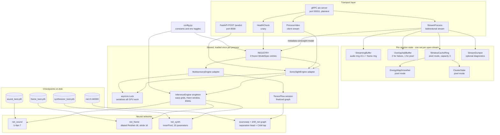

One property of Figure 2 is worth stating explicitly because it is a source of
subtle bugs: the inference engine singleton is shared, and it carries mutable
state across calls — an exponential moving average of the input gain and, when
enabled, an exponential moving average of the mask. Two concurrent streams
therefore influence one another's gain smoothing. The pixel path was given its
own private gain average precisely so that a pixel stream cannot perturb a
halves stream, but the two non-pixel modes still share one.

### 4.2 The two request paths

**Streaming.** `StreamProcess` is a bidirectional streaming remote procedure
call. The client sends a stream of chunks and receives a stream of results,
both open for the lifetime of the session. This is the path the entire live
experience runs on and is what Sections 6 and 7 describe in detail.

**One-shot.** `ProcessVideo` accepts a whole video file as a sequence of
256-kilobyte chunks, reassembles it to disk, runs FFmpeg to normalise it to
eight frames per second and mono audio at 11025 Hz, extracts frames with
OpenCV, runs a single centred inference, and returns separated audio plus two
224 × 224 floating-point maps. The FastAPI endpoint performs the same work over
HTTP and returns base64-encoded WAV and JPEG payloads. Both accept the Sound of
Pixels model only. Chunks must arrive in strictly increasing index order, the
first must carry metadata, an inactive stream is abandoned after thirty seconds
and the whole transfer after two minutes, and the temporary directory is
removed whether the request succeeds or fails.

### 4.3 The model registry and the engine abstraction

**How a model is described.** A model is one frozen dataclass instance in a
dictionary keyed by the identifier the client sends. Freezing is deliberate:
the fields are validated constants, and the project has twice been burned by
treating such a constant as a tunable (Section 8.2). Table 6 gives every field
and its value for all three registered entries.

**Table 6 — The model specification, and the three registered entries.**

| Field | Meaning | `sonicsight` | `sonicsight-pixel` | `multisensory` |
|---|---|---|---|---|
| `id` | Metadata value and echo | `sonicsight` | `sonicsight-pixel` | `multisensory` |
| `display_name` | Name shown to the user | Music & Instruments | Touch | Speech |
| `engine_factory` | Lazy engine constructor | Sound of Pixels adapter | *the same adapter instance* | multisensory adapter |
| `frame_rate` | Frames per second the client sends | 8 | 8 | 30 |
| `capture_sample_rate` | PCM rate on the wire | 11025 | 11025 | 22050 |
| `frame_kind` | Frame geometry | `left_right_halves` | `full_letterboxed` | `full_letterboxed` |
| `frame_dim` | JPEG side length | 224 | 224 | 224 |
| `audio_chunk_field` | Which chunk field carries audio | `audio_pcm` | `audio_pcm` | `audio_pcm_hi` |
| `model_sample_rate` | Rate the model consumes internally | 11025 | 11025 | 21000 |
| `window_samples` | Inference window, at the wire rate | 65536 | 65536 | 46352 |
| `hop_samples` | Overlap-add hop, at the wire rate | 1378 | 1378 | 5512 |
| `num_frames` | Frames per window | 3 | 3 | 63 |
| `frame_selection` | Which frames form a window | `centered_triple` | `centered_triple_full` | `consecutive_span` |
| `frame_ring_cap` | Frames retained | 60 | 60 | 90 |
| `early_min_samples` | Threshold below which early inference is attempted; equal to the window disables it | 11025 | 11025 | 46352 |
| `output_sample_rate` | PCM rate of returned audio | 11025 | 11025 | 22050 |
| `heatmap_count` | Number of legacy maps in a result | 2 | 0 | 1 |
| `stream_labels` | What the two audio outputs mean | Left, Right | Selection, Everything else | On-screen, Off-screen |
| `confidence_gated` | Server may withhold a meaningless map | no | no | yes |
| `window_min_advance` | Minimum timeline advance between windows, in samples | 1 | 1 | 5512 |
| `mode` | How the scene is divided | `halves` | `pixel` | `halves` |

Two entries in Table 6 deserve comment.

`window_min_advance` exists because frame arrival and window advance are not
the same thing. On the Sound of Pixels branch, eight frames per second already
*is* the 125-millisecond hop, so pacing by frame arrival is correct and the
value is one sample. On the speech branch thirty frames per second arrive while
the intended hop is 250 milliseconds; without a minimum advance a newer window
would exist after every frame and inference would run back to back, pegging the
GPU and starving the ingest loop.

`engine_factory` for the two Sound of Pixels entries returns the same adapter,
which in turn delegates to a module-level singleton. Halves mode and touch mode
therefore share one set of loaded weights; touch mode costs no additional video
memory for parameters.

**How a model is served.** An engine adapter is a small class with four
members: `load`, an `is_loaded` property, a `device` property, and
`eval_stream_window(audio_window, frames)`. The last returns a dictionary with
separated audio for both outputs, one or two maps in the interval from zero to
one, an optional diagnostics dictionary, and — for confidence-gated models — a
confidence scalar. The framework import belongs inside `load`, not at module
scope, so that the module still imports on a machine without that framework and
the rest of the server keeps working.

**Adding a model** is therefore: one registry entry, one adapter, one mirrored
client profile, and a protocol addition only if the model needs a capture
format that does not already exist. Nothing in the streaming loop is
model-aware; every branch it takes is driven by a specification field.

### 4.4 Session and stream lifecycle

**Selection.** When a stream opens, the handler reads the call metadata. An
absent key resolves to the default model, so a client that predates the
registry keeps working. An unknown identifier, or a known identifier whose
engine failed to load, aborts the call with `FAILED_PRECONDITION` and a message
naming what is available.

**Dispatch.** A specification whose mode is `pixel` is served by a separate
loop. The halves and speech modes share the original loop, which is left
structurally unchanged from the pre-registry server.

**Ingest.** For each arriving chunk the handler reads the audio field named by
the specification, converts the 16-bit samples to floating point in the
interval from minus one to one, and appends them to a ring capped at fifteen
seconds. When the ring overflows, the discarded prefix advances both an
absolute sample counter and the buffer's notion of its own start time, so
window positions stay expressed in absolute sample coordinates that never
restart. JPEG decoding runs on a worker thread; the resulting images are
appended to a frame ring with a per-model capacity, and frames whose timestamps
are stale or out of order are dropped with a warning.

**Window selection, normal mode.** The buffer searches backwards from the
second-newest frame for the newest frame whose surrounding half-window of audio
is entirely inside the buffered range. The corresponding start sample is then
floored to a multiple of the STFT hop. That flooring is not cosmetic: it makes
the frames the transform sees identical to the frames an un-sliced transform of
the whole timeline would have produced, which is what allows independently
computed windows to be stitched without a sub-sample phase discontinuity. The
consequence is that consecutive window starts advance by multiples of 256
samples — in practice 1280, 1536 or 1792 rather than the nominal 1378 — and
everything downstream is written to tolerate that.

**Window selection, early mode.** Before the buffer has filled, a window can
still be formed by taking all available audio and zero-padding to the full
length. The mode exists to shave the Sound of Pixels branch's 5.9-second fill
time. It is disabled on the speech branch, whose window is short enough not to
need it, by setting the early threshold equal to the window length.

Early mode carries two guards, both of which encode a defect that has already
occurred:

- Early windows are never fed to the overlap-add buffer. If they were, the
  first normal window would have to drain the entire gap between the early
  centre near sample zero and the normal centre near sample 32079 in one
  emission — roughly 26 000 samples. The client's jitter buffer holds about
  16 500, so the write would wrap the ring more than once and corrupt
  everything already in it.
- A second, unconditional cap trims any drain longer than 1.5 seconds and logs
  loudly. In the halves loop this cap is computed from the module-level
  11025 Hz constant rather than from the stream's own output rate, which makes
  it a 0.75-second cap on the 22050 Hz speech branch (Section 11.4).

**Reconstruction.** Each side owns an overlap-add buffer. Its contract is
timeline-driven rather than hop-driven: it tracks the absolute index of the
next sample that must be emitted, and each window emits exactly from that index
to the end of its own centre region. Total emitted length therefore equals the
real advance of the timeline, with no gaps and no duplicates, whatever the
actual spacing of the windows. The last 128 samples of each emission are held
back and re-read from the next window, so the two blended segments cover the
*same* absolute instants and the crossfade is a true blend of two independent
estimates rather than a splice between adjacent regions. The fade pair is
squared sine and squared cosine, which sum to one. Counters record how often
the buffer had to fill a gap, fall back to a splice, or discard a window that
arrived too late to contribute.

**Pixel-mode lifecycle.** The pixel loop differs in four ways. It runs one
feature pass per window and stores the intermediates in a ring of three window
caches. It answers spatial queries in band, immediately, without touching a
network. It maintains two time-to-live latches — one for freeze, one for
cluster discovery — because the client's audio and frame chunks are produced by
different threads and a strict per-chunk level would flap several times a
second. And it emits the *unseparated* mixture on the left audio field, through
the same centre-slice stitching, as the baseline the client mixes against —
unless a sticky region is set, in which case that region's synthesis takes the
mixture's place.

### 4.5 Concurrency model

The server runs one asyncio event loop for gRPC on the main thread, and the
FastAPI application on a separate daemon thread with its own loop and its own
uvicorn server.

Every open stream is an asynchronous generator on the gRPC loop. Nothing inside
it blocks: JPEG decoding, inference, and the pixel-mode cell analysis all run
through `asyncio.to_thread`, which dispatches to the default thread-pool
executor. Because the heavy work inside those threads is PyTorch and
TensorFlow, both of which release the global interpreter lock for the duration
of their native calls, this genuinely overlaps computation with the event
loop's protocol handling.

GPU access is serialized by one asyncio lock owned by the servicer. Every entry
point that touches the device takes it: streaming inference, the one-shot
`ProcessVideo` inference, the pixel-mode feature pass, the pixel-mode cell
analysis, region synthesis for a query, and sticky-region synthesis. The lock is
held across the `to_thread` await, so exactly one stream is inside the GPU at a
time and the rest queue on the loop. This is the mechanism that makes "both
models resident, one at a time" true in practice as well as in design.

Two smaller decisions belong here. Python's cyclic garbage collector is
disabled for the duration of each streaming inference and its generation
thresholds are raised, because a generation-one collection landing inside the
latency path produced multi-hundred-millisecond stalls; a generation-zero
collection is forced afterwards. And cuDNN autotuning is enabled at load time,
which makes the first inference several times slower than the steady state and
every subsequent one faster.

### 4.6 Configuration surface

Table 7 lists every environment variable that changes behaviour. Table 8 lists
the constants that are *not* environment variables and are locked to the
checkpoint — changing any of them means the weights are being fed something
they were not trained on. Appendix C carries the complete list including
constants not reproduced here.

**Table 7 — Environment variables.**

| Variable | Default | Effect of changing it |
|---|---|---|
| `SONICSIGHT_BINARY_MASK` | `0` | `1` thresholds the mask at 0.5 instead of using it as a ratio. Sharper separation; destroys the property that the outputs sum to the mixture. |
| `SONICSIGHT_MASK_RENORM` | `1` | `0` disables renormalising the mask set. Recorded effect on a quiet clip: energy retention falls from 85 % to 5.4 %. |
| `SONICSIGHT_MASK_RENORM_FLOOR` | `0.0` | Raises the clamp on the renormalisation divisor. Recorded effect on a quiet clip: a floor of 0.25 drops retention from 0.837 to 0.459. The code's own comment records that the reasoning that originally motivated this floor was wrong. |
| `SONICSIGHT_SEPARATION_MODE` | `video` | `pixel` conditions the mask on the most sound-active cells of each crop instead of one globally pooled vector. The paper prescribes the pixel form at test time; the deployed default is `video`, so the deployed behaviour is the paper's *train*-time pooling. |
| `SONICSIGHT_SEP_TOPK` | `4` | Number of top-activation cells averaged in `pixel` conditioning. No effect under the default mode. |
| `SONICSIGHT_MASK_SMOOTH` | `1.0` | Values below 1 apply an exponential moving average to the mask across windows. Documented as the anti-warble fix; **inactive at the default**. |
| `SONICSIGHT_AUDIO_NORM` | `1` | `0` disables bringing the input window to a fixed level. Recorded effect on a quiet clip: correlation with the reference improves from 0.503 to 0.247 with normalisation on, retention from 0.837 to 0.921. |
| `SONICSIGHT_AUDIO_NORM_TARGET_RMS` | `0.10` | The level the input is scaled to. Effectively locked: it is the level the batch-normalisation statistics were trained at. |
| `SONICSIGHT_AUDIO_NORM_MAX_GAIN` | `20.0` | Cap on that scaling, so near-silence is not amplified into noise. |
| `SONICSIGHT_AUDIO_NORM_MIN_RMS` | `1e-4` | Below this the window is treated as silence and left alone. |
| `SONICSIGHT_AUDIO_NORM_SMOOTH` | `0.3` | Smoothing of the gain across windows, streaming path only. Raising it towards 1 makes each window pick its own gain, which pumps at the seams. |
| `SONICSIGHT_DUMP_STREAM` | `0` | `1` records a full per-session diagnostic bundle. Buffered in memory, written at stream end. |
| `SONICSIGHT_DUMP_DIR` | `src/outputs/streamdump` | Where that bundle is written. |
| `MULTISENSORY_ROOT` | sibling `../multisensory` | Location of the multisensory checkout. |
| `MULTISENSORY_CHECKPOINT` | `<root>/results/nets/sep/full/net.tf-160000` | Which separation checkpoint to restore. |
| `MULTISENSORY_RESULTS` | `../results` | Root the multisensory parameter module resolves its own checkpoint paths against. |
| `MS_GPU` | `0` | GPU index for the TensorFlow session; `cpu` leaves it unpinned. |
| `MS_GPU_ALLOW_GROWTH` | `1` | `0` restores the default behaviour of claiming the whole card, which prevents PyTorch from allocating. |
| `MS_GPU_MEM_FRACTION` | unset | Hard ceiling on the fraction of video memory TensorFlow may use. The instrument for guaranteeing PyTorch a share. |
| `MS_GPU_LOG` | unset | `1` prints the resulting session configuration. |
| `TF_CUDNN_WORKSPACE_LIMIT_IN_MB` | `512`, set by the multisensory module itself | Uncapped, cuDNN probes multi-gigabyte workspaces and the allocator holds about 2.9 GB for a working set of roughly 0.5 GB. **Do not remove.** |

**Table 8 — Constants locked to the checkpoints.**

| Constant | Value | Why it is locked |
|---|---|---|
| Sound analysis architecture | U-Net with 7 downsamplings | Checkpoint layer shapes |
| Frame analysis architecture | dilated ResNet-18, stride 16 | Checkpoint layer shapes; also fixes the feature grid at 14 × 14 |
| Synthesizer architecture | linear inner product | Checkpoint has 33 parameters: 32 scales and one bias |
| Feature channels *K* | 32 | Checkpoint; note this is **not** the paper's 16, and the builder's own default of 64 is overridden |
| Frames per window | 3 | Matches the checkpoint's temporal pooling |
| Image side | 224 | Network input |
| Analysis window | 65536 samples | Window the separation was trained at |
| Audio rate | 11025 Hz | Rate the checkpoint was trained at |
| STFT frame, hop | 1022, 256 | Produce the 512 × 256 grid the network expects |
| Log-frequency warp | enabled | The network consumes a log-frequency spectrogram |
| Image pooling | max | Checkpoint's training-time pooling |
| Multisensory window | 2.135 s, 44144 samples at 21000 Hz | See Section 8.2 — the single most consequential locked value in the project |
| Multisensory frames per window | 63 | Determined by the window length and 29.97 frames per second |
| Multisensory map resolution flag | disabled | The higher-resolution variant correlates 0.0684 with the validated one |
| Multisensory input level | root mean square of 0.1414 | Level the network expects |

### 4.7 Checkpoint loading and health reporting

At start-up the server walks the registry and calls `load` on every engine. A
failure is caught, logged with a traceback, and does not stop the server; the
model is simply absent afterwards. This is what allows the whole system to run
on a machine with no TensorFlow at all, serving the two Sound of Pixels modes
and rejecting requests for the speech model with a clear precondition failure.

The Sound of Pixels adapter loads three PyTorch files, moves all three networks
to the selected device, precomputes the two frequency warp grids and the
analysis window, and runs one dummy inference to force cuDNN's autotuning to
happen before a client is waiting. Automatic mixed precision, which computes
parts of the forward pass at half precision, is enabled only on devices whose
name does not identify them as GTX 16-series — those cards have no tensor
cores, so the casting overhead costs more than the arithmetic saves. The
localization branch is forced back to single precision regardless, because
half-precision underflow flattens it.

The multisensory adapter locates the repository and checkpoint, verifies the
checkpoint index file exists, inserts the repository's source directory on the
import path, and only then imports TensorFlow. It then asserts two invariants
before building anything: that the parameter module still reports the locked
window length, and that the higher-resolution map flag is off. Either being
wrong raises rather than proceeding. After the graph is built it checks that
the class-activation-map tensor is actually present, which it is only for the
full network style.

`HealthCheck` reports the device string, the list of model identifiers whose
engines report themselves loaded, and a boolean that is true when that list is
non-empty. **The Android client never calls it.** The remote procedure exists,
is implemented, and is exercised only by a manual script and by the written
test plan; the client discovers an unavailable model from the precondition
failure when it opens a stream.

**Figure 3 — Backend module dependency graph.** Derived from the import
statements, not from intent. Solid edges are module-level imports; dotted edges
are imports deferred into a function body, which is how the server stays
importable without TensorFlow and without paying the pixel-mode import cost on
streams that do not use it.

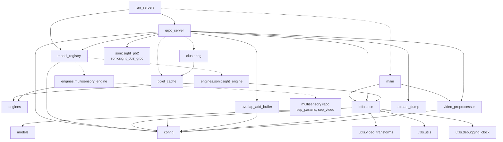

The graph is acyclic and shallow. Three observations follow from it. The
configuration module is a leaf that almost everything depends on, which is why
its constants are effectively global. The clustering module depends on the
pixel cache only for the grid dimensions, so source discovery cannot drift out
of step with the feature grid. And two of the edges into the inference module
are dead weight: the debugging clock is imported and never used, as is one
constant, and the loss classes reachable through the models package are
training-only and never constructed at inference.

---

## 5. Mobile architecture

### 5.1 Layering

The client follows the **model-view-viewmodel (MVVM)** pattern, using Android
XML layouts with view binding rather than a declarative UI toolkit. Figure 4
shows the layers and the direction of data flow.

- **View.** One activity owns the camera, the microphone, the controls and the
  touch surface. A second activity displays the result of the one-shot file
  path. Three custom views draw the feature lattice, the legend ramp, and the
  camera preview.
- **ViewModel.** One view model owns the outbound message flow, the stream
  job, the current model profile, and every piece of observable state the view
  renders. It survives configuration changes; the activity does not.
- **Repository.** One class wraps the generated stub, attaches the model
  metadata, and returns a flow of results. It is the only place that knows the
  metadata key exists.
- **Data sources.** CameraX, `AudioRecord`, the gRPC channel, and the two
  `AudioTrack` instances behind their jitter buffers.
- **Utilities.** Pure transformation code with no Android lifecycle
  dependencies: the image transform, the decimator, the overlay renderer, the
  coordinate map. The coordinate map has JVM unit tests precisely because it is
  pure.
- **Profiles.** A client-side mirror of the server's specification, one entry
  per model, holding the capture and playback constants the rest of the client
  reads.

**Figure 4 — Mobile architecture by MVVM layer.**

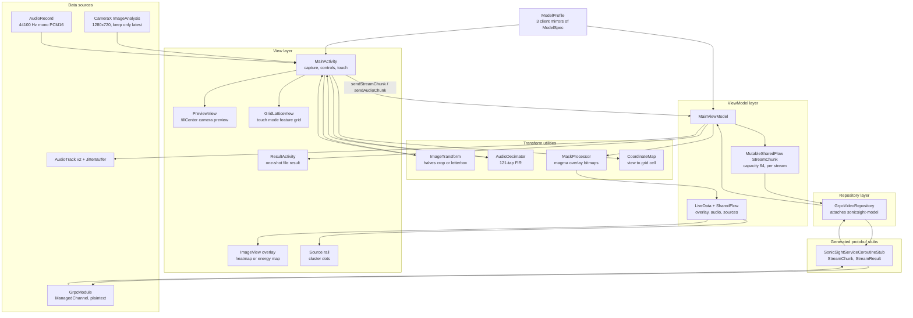

### 5.2 Video capture and the image transform chain

CameraX is configured with an image-analysis use case at a target resolution of
1280 × 720 and a backpressure strategy of keeping only the latest frame, bound
to the activity lifecycle alongside a preview use case on the rear camera. The
analyzer runs on a dedicated single-thread executor. It throttles to the active
profile's frame interval — 125 milliseconds for both Sound of Pixels modes,
33 milliseconds for the speech mode — and closes every proxy whether or not it
processed it, so the camera never stalls.

The transform chain, in order, with exact arithmetic for a 1280 × 720 sensor
frame:

1. **Colour conversion.** The three planes of the YUV proxy are packed into an
   NV21 buffer, compressed to JPEG at quality 100, and decoded back to an
   ARGB bitmap. This is a round trip through the JPEG codec purely to obtain a
   colour conversion, and it is the most obviously wasteful step in the client
   (Section 11.4).
2. **Rotation.** If the image information reports a non-zero rotation, the
   bitmap is rotated by that many degrees. The post-rotation dimensions are
   recorded, because the touch coordinate chain needs the real numbers.
3. **Branch on frame kind.**

   *Left/right halves.* The bitmap is split at half its width into two
   640 × 720 halves. Each half has its **smaller** edge scaled to 256, giving
   256 × 288. Each is then centre-cropped to 224 × 224, taking the crop origin
   at ((256 − 224) / 2, (288 − 224) / 2) = (16, 32). Each half therefore keeps
   224/256 = 87.5 % of its width and 224/288 = 77.8 % of its height. This
   reproduces the resize-then-centre-crop that the original evaluation
   transform performed on the server, moved to the device so that only 224-pixel
   squares cross the network.

   *Full letterbox.* The bitmap is scaled uniformly by 224 / max(width, height)
   = 224/1280 = 0.175, giving 224 × 126, and drawn centred on a
   224 × 224 canvas filled with mid-grey. The content therefore occupies rows
   49 to 174, with 49 grey rows above and 49 below.
4. **Compression.** JPEG at quality 90.

The client instruments this chain: it counts frames arriving and frames sent,
accumulates encode time, and logs a summary every five seconds. The **field of
view (FOV)** arithmetic in step 3 has a latent consequence in portrait
orientation, discussed in Section 11.3.

### 5.3 Audio capture

Android guarantees only 44100 Hz on `AudioRecord`. Requesting a lower rate
delegates to a vendor resampler whose behaviour varies by device, and on some
devices that resampler destroys most of the content above a few hundred hertz
while leaving the sample stream structurally valid — a failure that is
invisible except by listening. The client therefore captures at 44100 Hz and
decimates in the application, where the filter is known.

The source is chosen by preference: an unprocessed source if the device
advertises one, then the camcorder source, then the microphone source last,
because that one receives the most aggressive vendor processing — noise
suppression, automatic gain control, narrowband voice equalisation — all of
which are harmful to a separation model.

Each read requests 5512 samples, which is 11024 bytes and 124.99 milliseconds
at 44100 Hz, and the buffer is sized at four times that or the platform
minimum, whichever is larger. The decimator is a 121-tap Hamming-windowed sinc
low-pass with unity gain at direct current, evaluated only at output positions
so its cost scales with the output rate, and with filter state carried across
calls so block boundaries introduce no discontinuity. Its integer factor and
cutoff come from the profile: divide by four with a 5000 Hz cutoff for the two
11025 Hz modes, divide by two with a 10000 Hz cutoff for the 22050 Hz speech
mode. Both are exact integer factors of 44100. Output is 1378 samples
(2756 bytes) or 2756 samples (5512 bytes) per block.

Which protocol field carries the audio is decided by rate, not by frame kind:
touch mode sends full frames but 11025 Hz audio, so only the speech branch uses
the high-rate field.

### 5.4 The chunk emitter and backpressure

All outbound chunks pass through one shared flow with a buffer capacity of 64,
recreated for every stream so that chunks buffered for a cancelled stream can
never leak into the next one — the capture profiles are incompatible, so a
leaked chunk would be actively harmful.

The two producers use deliberately different emission semantics:

- **Frames use a non-suspending attempt.** If the queue is saturated the frame
  is dropped. This is correct: the next frame is 33 to 125 milliseconds away,
  and blocking the camera analyzer thread would be worse than losing a frame.
- **Audio uses a suspending emission and waits for space.** Audio must never be
  dropped. The server's window timeline is reconstructed from received samples,
  so every lost chunk makes the buffered audio fall further behind the frame
  timestamps until no valid window exists at all. At thirty frames per second
  the frame flood can saturate the queue, which is exactly the situation this
  asymmetry exists to survive.

### 5.5 The gRPC client, stream lifecycle and reconnection

A single channel is built lazily and cached: plaintext, 16-megabyte inbound
message limit, keep-alive pings every thirty seconds including when idle, and a
ten-second keep-alive timeout so a dead connection is detected rather than hung
on. The host is a compiled-in default overridable at run time through a
settings dialog and persisted in shared preferences; changing it shuts the
channel down so the next use reconnects. The port is fixed.

Opening a stream attaches the model metadata through a header interceptor and
returns a flow of results, collected in the view model's scope. Cancelling that
job cancels the call.

**There is no automatic stream re-establishment.** A transport failure
propagates through the flow's error handler to an error state, which tears the
session down and shows guidance naming the configured host. Recovery is the
user pressing the button again. The channel itself will reconnect for the next
call, but the session does not resume by itself.

### 5.6 Playback and overlay rendering

**Playback.** Two `AudioTrack` instances are created in streaming mode at the
profile's rate, one hard-panned left and one hard-panned right, so the two
separated streams are spatially distinguishable on headphones. Neither is
started directly. Each is fed by a jitter buffer that accumulates incoming PCM
in a ring sized for 1500 milliseconds, delays the start of playback until
200 milliseconds have accumulated, then drains on a dedicated thread at
urgent-audio priority in 256-sample writes. When the ring runs dry the drain
thread writes silence rather than stopping, which keeps the track's clock
running and turns an underrun into a brief gap instead of a click; after three
consecutive underruns the initial target grows by 50 milliseconds, up to a
maximum of 500. Solo is implemented as volume on the two tracks rather than as
a change to what the server sends.

**Overlay.** Maps arrive as unsigned bytes. The renderer infers the grid side
from the square root of the byte count, so any square map decodes without a
client change; for the touch mode's energy map the dimensions are explicit on
the wire and are used rather than inferred, because that map is not square in
content. Values are coloured with the magma palette — perceptually uniform and
monotonic in lightness, so it survives red-green colour-vision deficiency and
stays dark over the camera image where there is nothing to show — and alpha is
the value raised to the power 2.5, scaled to a maximum of 200. That exponent
is what keeps low activations from accumulating into a uniform haze. In halves
mode the two 56 × 56 maps are each scaled to 336 × 336 and stitched
side by side; in touch mode the single native-resolution map is drawn through a
computed affine transform that registers the letterboxed grid onto the
centre-cropped camera preview, and the same transform positions the feature
lattice.

**Touch.** The coordinate chain is view coordinates, then the inverse of the
preview's centre-crop mapping, then the letterbox geometry, then normalisation,
then the grid cell. It is pure arithmetic in a separate object with unit tests,
because an off-by-one here presents as "subtly wrong" and is very hard to
diagnose later. A tap sends one query; a drag sends one query per cell crossed;
a long press converts the selection into a sticky region the live stream
follows.

### 5.7 Threading model

**Figure 5 — Mobile threading and dispatcher model.** Each box is one thread or
dispatcher; edges crossing boxes are hand-offs between them.

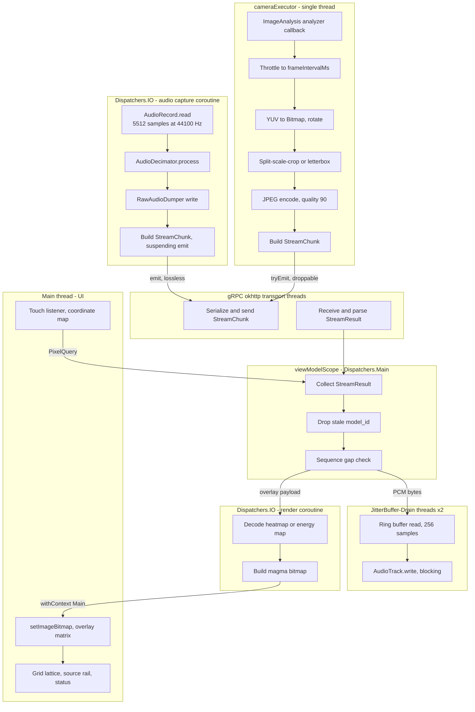

The division of labour is: one thread does all image work, one coroutine does
all audio capture, the transport owns its own threads, result handling starts
on the main dispatcher and moves to input/output for bitmap construction and
back to main for the single call that touches a view, and two dedicated
high-priority threads own playback. The blocking write inside the drain loop is
what paces it — the platform consumes the data at real-time speed, so the loop
needs no timer of its own.

---

## 6. Communication protocol

### 6.1 The contract and its two copies

The interface is defined in one protocol-buffers file using proto3. The backend
keeps it at the repository root and generates Python stubs with `grpc_tools`;
the mobile repository keeps a copy under its source tree from which Gradle
generates Java and Kotlin stubs at build time. The two copies were verified
byte-identical for this report. Appendix B reproduces the file in full.

The service exposes three remote procedures:

| Procedure | Kind | Purpose |
|---|---|---|
| `StreamProcess` | bidirectional streaming | The live path. `StreamChunk` up, `StreamResult` down, both continuous. |
| `ProcessVideo` | client streaming | Upload a whole file, receive one `InferenceResult`. |
| `HealthCheck` | unary | Report device and which model checkpoints loaded. |

Channel parameters are set on both sides. The server allows 16-megabyte
messages in each direction and enables gzip at its lowest compression level,
which trades roughly a millisecond of processor time per message for a
substantial reduction in payload on a congested link. The client sets the same
inbound limit, uses plaintext, and enables keep-alive pings every thirty
seconds with a ten-second timeout, including when no call is active.

### 6.2 Messages

**`Empty`** carries nothing.

**`HealthResponse`.** `model_loaded` (field 1) is true when *any* model loaded,
not when all did. `device` (2) is the string form of the PyTorch device, or
`not loaded`. `loaded_models` (3) is the list of identifiers whose engines
report themselves loaded, in registry order.

**`VideoChunk`** and **`VideoMetadata`** carry the one-shot upload: an optional
metadata submessage required on the first chunk only, the raw bytes, a
zero-based index that must increase by exactly one per chunk, and a final-chunk
flag. Chunks are 256 kilobytes.

**`InferenceResult`** is the one-shot reply: a success flag and error string;
separated audio as 16-bit signed PCM at 11025 Hz for both sides; the sample
rate as an integer, always 11025; two heatmaps as raw little-endian 32-bit
floats of shape 224 × 224, which is 50 176 values and **200 704 bytes per
side**; two JPEG centre frames; and elapsed milliseconds.

**`StreamChunk`** is the uplink message. Fields 1 to 9 carry media, 10 to 13
carry touch-mode control.

| Field | № | Type | Semantics, units, size |
|---|---|---|---|
| `timestamp_ms` | 1 | int64 | Milliseconds since the session started, measured on the device's monotonic clock. Frame and audio chunks are stamped independently. |
| `left_jpeg` | 2 | bytes | JPEG, 224 × 224, quality 90. Left half of the frame. |
| `right_jpeg` | 7 | bytes | JPEG, 224 × 224, quality 90. Right half. |
| `frame_width` | 3 | int32 | Set to 224 by the client. **Never read by the server.** |
| `frame_height` | 4 | int32 | Set to 224 by the client. **Never read by the server.** |
| `audio_pcm` | 5 | bytes | PCM16 mono little-endian at 11025 Hz. 1378 samples, 2756 bytes per chunk, one chunk per 125 ms. |
| `is_last` | 6 | bool | Final chunk; ends the server loop and triggers the overlap-add flush. |
| `full_jpeg` | 8 | bytes | JPEG, 224 × 224, letterboxed whole frame. |
| `audio_pcm_hi` | 9 | bytes | PCM16 mono little-endian at 22050 Hz. 2756 samples, 5512 bytes per chunk, one chunk per 125 ms. |
| `queries` | 10 | repeated `PixelQuery` | In-band spatial queries. |
| `request_clusters` | 11 | bool | Requests source discovery. Latched for 16 chunks. |
| `freeze` | 12 | bool | Pins the newest completed window. Latched for 16 chunks. |
| `clear_sticky` | 13 | bool | Releases the followed region. |

**`PixelQuery`.** A client-assigned identifier echoed in the answer; normalized
coordinates in the letterboxed 224 × 224 space — the one space both sides can
compute exactly; a radius as a fraction of frame width, where zero means
exactly one feature cell; a window identifier where zero means "newest"; and a
sticky flag that converts the query from a one-shot answer into a standing
selection the live stream follows.

**`PixelAudio`.** The answer: the echoed identifier; PCM16 mono at 11025 Hz;
the sample count; a **relative** energy in the interval from zero to one, being
the region's fraction of the window's total mixture energy, which makes the
client's "nothing here" threshold scale-free; the window it came from; and a
non-empty error string when the requested window was evicted or the query cap
was exceeded.

**`SourceCluster`.** One discovered source: a stable identifier, a normalized
centroid in letterbox space, an energy, and a packed 24-bit colour assigned by
the server and carried across windows.

**`StreamResult`** is the downlink message.

| Field | № | Type | Semantics, units, size |
|---|---|---|---|
| `success` | 1 | bool | False marks an in-band failure; `error_message` explains. |
| `error_message` | 2 | string | Free text; the client pattern-matches it for guidance copy. |
| `timestamp_ms` | 3 | int64 | Centre of the analysis window this result describes, in the client's own timebase. |
| `left_audio_pcm` | 4 | bytes | PCM16 mono at the model's output rate. Meaning depends on the mode. |
| `right_audio_pcm` | 5 | bytes | As above; empty in touch mode. |
| `left_heatmap` | 6 | bytes | uint8, square grid, currently 56 × 56 = **3136 bytes**. Empty when withheld or unused. |
| `right_heatmap` | 7 | bytes | As above; populated only when `heatmap_count` is 2. |
| `center_frame_jpeg` | 8 | bytes | **Always empty on the streaming path.** |
| `is_buffering` | 9 | bool | Keep-alive: no result yet. Sent on every tenth chunk while filling. |
| `inference_time_ms` | 10 | int64 | Model call duration. Not populated in touch mode. |
| `post_processing_time_ms` | 11 | int64 | Stitching and encoding, floored at 1. Not populated in touch mode. |
| `total_server_time_ms` | 12 | int64 | Chunk arrival to result emission. Not populated in touch mode. |
| `sequence_number` | 13 | int32 | Monotonic per stream, for gap detection. In touch mode, **0 is reserved** for query answers and window results start at 1. |
| `audio_sample_count` | 14 | int32 | Samples per channel in this result. |
| `model_id` | 15 | string | Echo of the model that produced this result. |
| `heatmap_count` | 16 | int32 | 2 halves, 1 speech, **0 touch**. |
| `cam_confidence` | 17 | float | Raw positive fraction of the alignment map, 0 to 1. Zero for models without a gate. |
| `pixel_audio` | 18 | repeated `PixelAudio` | Query answers. |
| `energy_map` | 19 | bytes | uint8, row-major, at the native grid: 14 × 14 = **196 bytes**. |
| `grid_width` | 20 | int32 | 14. Explicit, never inferred. |
| `grid_height` | 21 | int32 | 14. |
| `cluster_labels` | 22 | bytes | uint8 per cell, 196 bytes, 255 meaning silence. |
| `clusters` | 23 | repeated `SourceCluster` | At most three. |
| `window_id` | 24 | int64 | The cached window this result describes. |

### 6.3 Which fields are populated in which mode

**Table 9 — Field population by model identifier.** A dash means the field is
left at its default.

| Field | `sonicsight` | `sonicsight-pixel` | `multisensory` |
|---|---|---|---|
| `StreamChunk.left_jpeg`, `.right_jpeg` | yes | — | — |
| `StreamChunk.full_jpeg` | — | yes | yes |
| `StreamChunk.audio_pcm` | yes, 11025 Hz | yes, 11025 Hz | — |
| `StreamChunk.audio_pcm_hi` | — | — | yes, 22050 Hz |
| `StreamChunk.queries`, `.freeze`, `.request_clusters`, `.clear_sticky` | — | yes | — |
| `StreamResult.left_audio_pcm` | left half | mixture, or the followed region | on-screen |
| `StreamResult.right_audio_pcm` | right half | empty | off-screen |
| `StreamResult.left_heatmap` | 3136 B | empty | 3136 B, or empty when gated |
| `StreamResult.right_heatmap` | 3136 B | empty | empty |
| `StreamResult.heatmap_count` | 2 | 0 | 1 |
| `StreamResult.cam_confidence` | 0.0 | 0.0 | populated |
| `StreamResult.energy_map`, `.grid_width`, `.grid_height` | — | yes | — |
| `StreamResult.cluster_labels`, `.clusters` | — | when latched | — |
| `StreamResult.window_id` | — | yes | — |
| `StreamResult.pixel_audio` | — | on query | — |
| timing fields 10 to 12 | yes | — | yes |

### 6.4 Where the comments disagree with the code

The brief for this report required that any divergence between a field's
comment and the behaviour of the code be named explicitly, and that the report
state which one it follows. **This report follows the code in every case.**

**Table 10 — Comment-versus-code divergences in the current protocol file.**

| Field | Comment says | Code does | Report follows |
|---|---|---|---|
| `StreamResult.left_audio_pcm` / `.right_audio_pcm` | "21000 Hz on the multisensory branch" | The engine resamples its 21000 Hz output back to **22050 Hz** before returning, the specification's output rate is 22050, and the client configures playback at 22050 | 22050 Hz |
| `PixelAudio.pcm` | "one analysis window long" | Only the last **2.0 seconds** are returned — 22050 samples, 44100 bytes — not the 65536-sample window | 2.0 seconds |
| `StreamResult.center_frame_jpeg` | "Sent back so the client doesn't need to buffer frames locally" | **Always empty** on the streaming path; a comment in the server records this as a deliberate bandwidth optimisation | always empty |
| `StreamChunk.frame_width` / `.frame_height` | "required if jpeg frames are present" | Never read anywhere in the server | not required |
| `StreamResult.heatmap_count` | lists only 2 and 1 | Also emits **0** in touch mode | 2, 1 or 0 |
| `StreamChunk.queries` | "capped at 4 per chunk" | The cap is applied to the index within the repeated field, and sticky queries consume an index before being skipped, so sticky entries earlier in the list count against the cap | position-based cap |
| `StreamChunk.freeze` | "LEVEL-triggered" | A rising edge pins; the level is then latched for 16 further chunks, so release lags the flag by up to 16 chunks | latched level |

The first two are the ones that would actually mislead an implementer: a client
written from the comment would play the speech branch's audio 5 % slow, and
would allocate a buffer three times larger than a query answer needs.

### 6.5 Metadata, status codes and in-band errors

One metadata key is defined: `sonicsight-model`, an ASCII string whose value
must equal a registered identifier. It is attached by a header interceptor when
the stream opens and is never sent again.

| Condition | Mechanism | Code or payload |
|---|---|---|
| Unknown model identifier | call aborted | `FAILED_PRECONDITION`, message lists the available identifiers |
| Known identifier, engine not loaded | call aborted | `FAILED_PRECONDITION`, message says "not loaded" |
| Upload chunk out of order | call aborted | `OUT_OF_RANGE` |
| First upload chunk without metadata | call aborted | `INVALID_ARGUMENT` |
| Upload idle 30 s, or total 120 s | timeout, then generic failure | in-band `success=false` |
| GPU out of memory during inference | in-band | `success=false`, `error_message` "GPU out of memory." |
| Any other server exception | in-band | `success=false`, `error_message` is the exception text |
| Query against an evicted or absent window | in-band, per query | `PixelAudio.error` "window not available…" |
| Query cap exceeded | in-band, per query | `PixelAudio.error` "query cap (4) exceeded" |
| Model confident there is nothing to localize | in-band, not an error | `left_heatmap` empty with `cam_confidence` below 0.10 |

The client maps the two abort messages and the transport-level unavailability
onto three pieces of guidance copy: the server cannot be reached at the
configured host, this model is not loaded on this server, or a generic failure
carrying the raw text.

### 6.6 Interaction sequences

**Figure 6 — Session establishment.** From the button press to the first
buffering acknowledgement. Note that no health check occurs: the client learns
about an unavailable model from the stream's precondition failure.

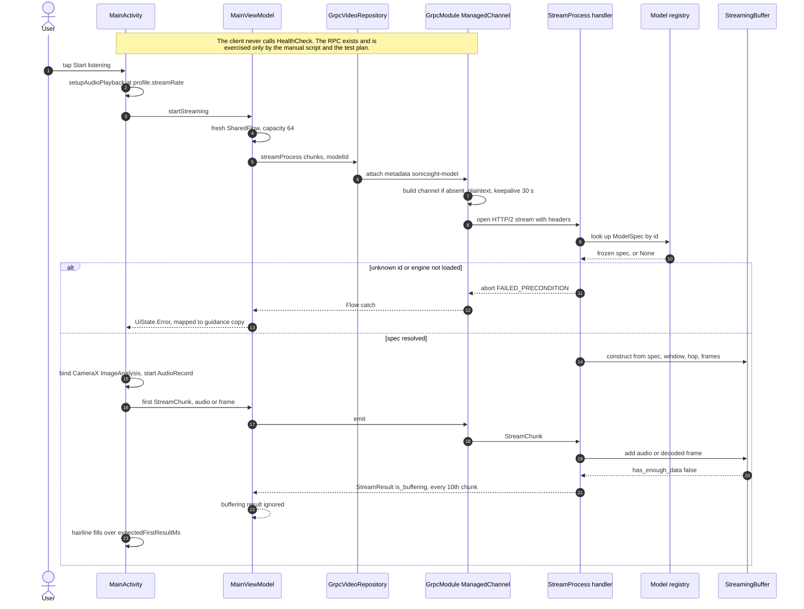

**Figure 7 — Steady-state streaming, halves mode.** Annotated with the computed
wire rates and sizes for model identifier `sonicsight`. The uplink runs at
about sixteen messages per second and the downlink at about eight.

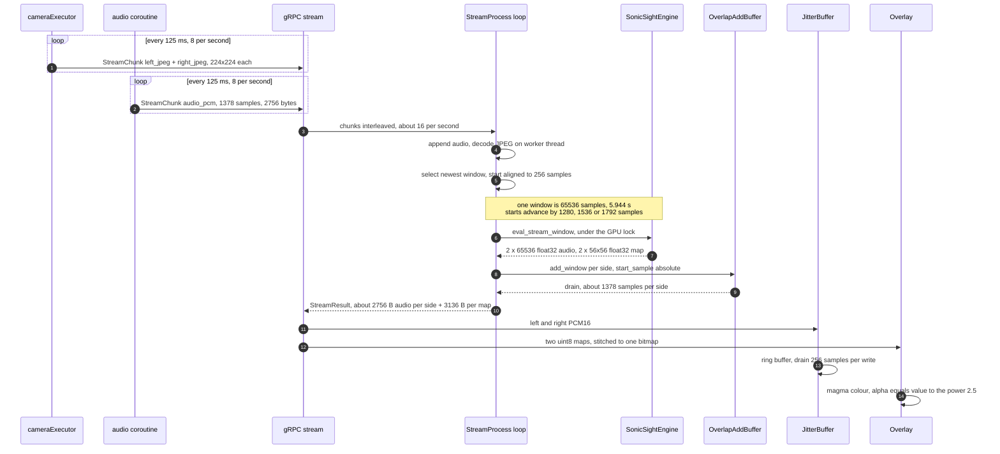

**Figure 8 — Model or mode switch.** The stream is cancelled and reopened; the
capture profile changes; in-flight results from the old model are discarded by
the identifier filter.

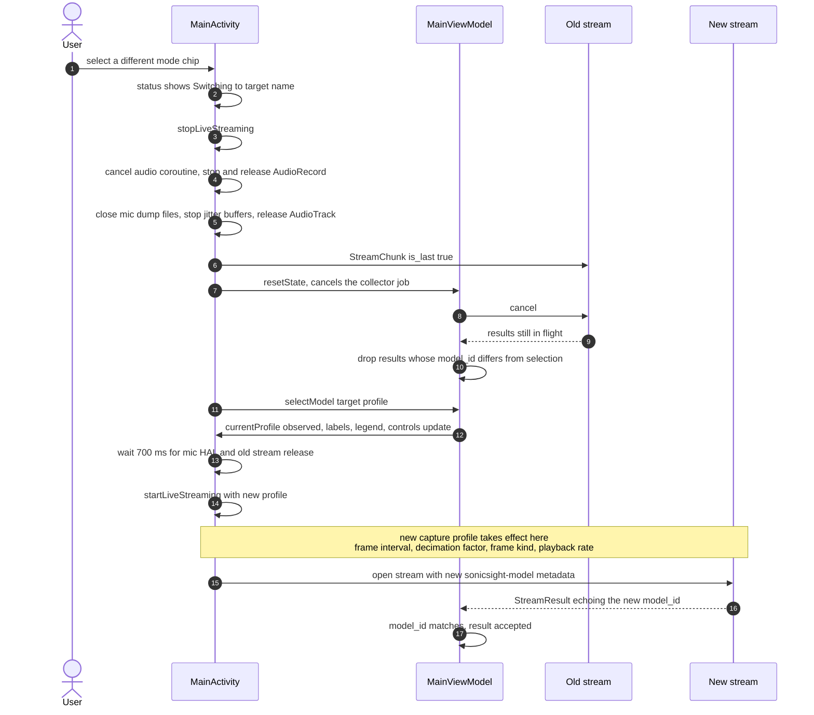

**Figure 9 — Error paths and teardown.** Five independent scenarios, shown in
one diagram for compactness; they do not occur in sequence.

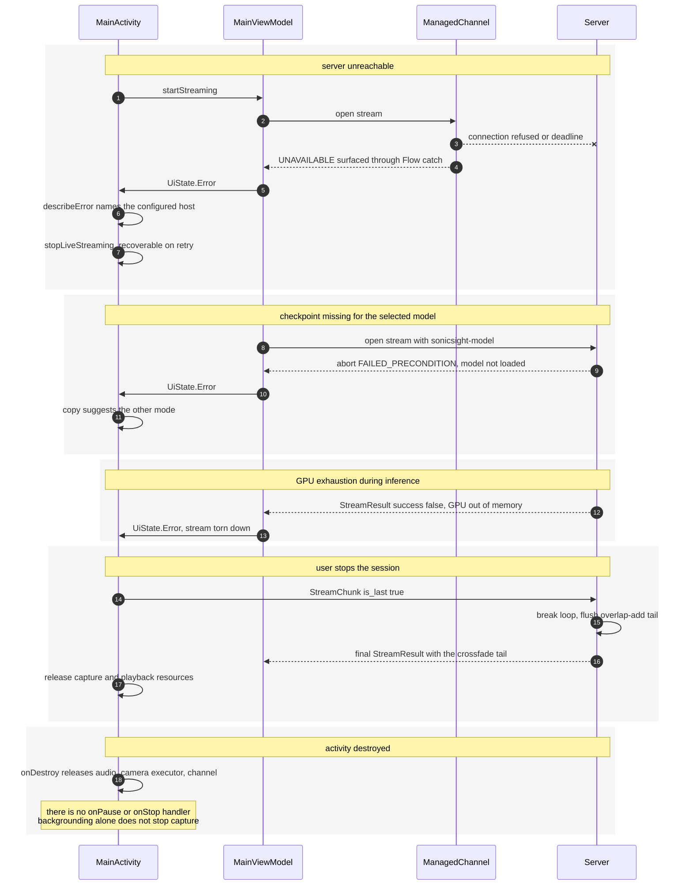

---

## 7. The processing pipeline

This section follows one window of data from the sensor to the loudspeaker.
Unless stated otherwise it describes the deployed left/right halves path,
model identifier `sonicsight`; Section 7.7 gives the deltas for the other two.
Figures 10a, 10b and 10c carry the same content as annotated graphs, with every
edge labelled by what flows along it. Table 11 is the same journey as a list,
for checking.

### 7.1 Device capture and pre-processing

**Figure 10a — Capture and pre-processing on the device.**

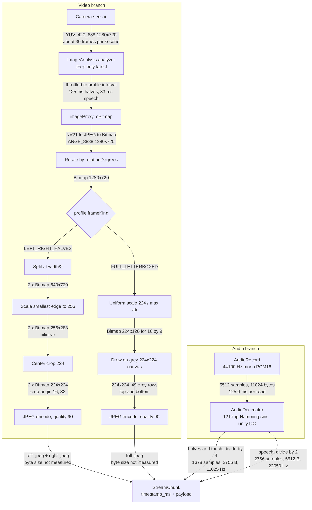

The two branches are independent and asynchronous: video chunks and audio
chunks carry separate timestamps taken from the same monotonic clock, and the
server reassembles the relationship between them from those timestamps rather
than from arrival order. This is why the audio path must be lossless while the
video path may drop.

### 7.2 Ingest, buffering and window selection

Arriving PCM is converted from 16-bit integers to 32-bit floats in the interval
from minus one to one by dividing by 32768, and appended to a ring holding at
most fifteen seconds — 165 375 samples at 11025 Hz. Arriving JPEGs are decoded
on a worker thread into RGB images and appended to a frame ring of sixty.

A window exists when the buffer holds at least the early threshold of audio and
at least three frames. The buffer then searches backwards from the
second-newest frame for the newest frame whose surrounding 2972.15 milliseconds
of audio on each side lie entirely inside the buffered range. The start sample
implied by that frame is floored to a multiple of 256 — the transform hop — and
the window is the 65536 samples beginning there. The centre timestamp is then
*recomputed* from the aligned start rather than taken from the frame, so the
timestamp the client receives describes the audio that was actually analysed.

Three frames are selected around that centre: the frame before, the frame
itself, and the frame after, each already split into left and right halves on
the device. Frames older than the selection are discarded.

### 7.3 Analysis and synthesis

**Figure 10b — Server-side inference.** Shapes are the values the code
produces, not the paper's.

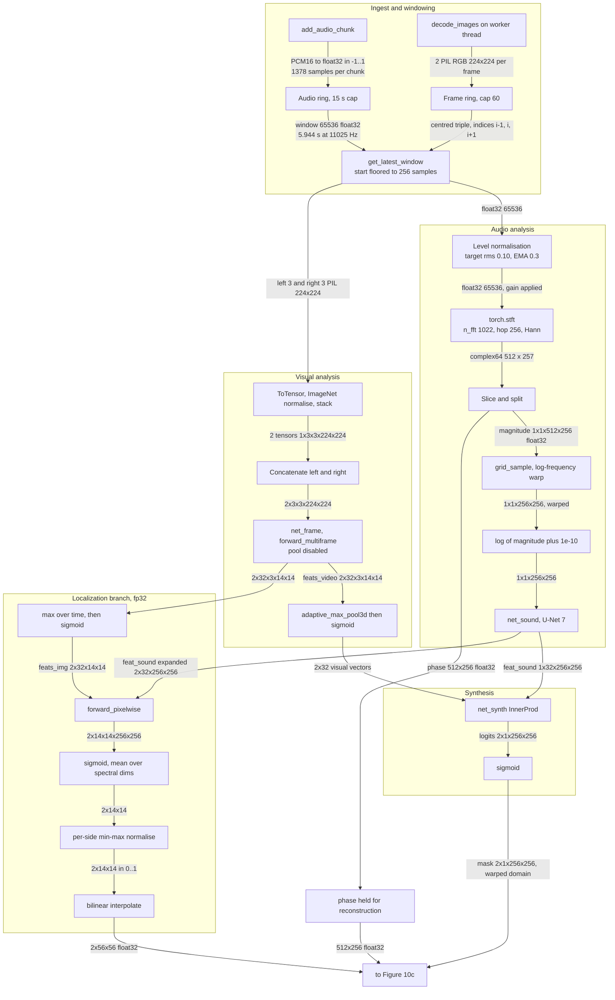

Four steps in Figure 10b deserve prose.

**Level normalisation.** The network is not scale invariant. Scaling a waveform
by a factor shifts its log spectrogram by the logarithm of that factor, which
moves the whole input off the distribution the batch-normalisation statistics
were estimated on. The window is therefore scaled to a root-mean-square of
0.10, with the gain capped at a factor of twenty in either direction and
windows below a root-mean-square of 0.0001 left alone as silence. In the
streaming path the gain is smoothed across windows with a coefficient of 0.3;
without that smoothing each overlapping window would receive a different gain
and the seams between them would pump audibly. The scaling is exactly
invertible — the masks are ratios and the phase is untouched — so dividing the
reconstruction by the same gain restores the original level with no
colouration.

**The log-frequency warp.** The network consumes a spectrogram whose frequency
axis is logarithmic, so the 512 linear bins are resampled to 256 warped bins by
bilinear sampling on a precomputed grid. The inverse grid, back to 512 linear
bins, is applied to the mask rather than to the audio. This asymmetry is the
reason the order of operations in reconstruction matters (Section 7.4).

**Visual pooling.** With the deployed configuration, the per-cell visual
features are collapsed to one 32-dimensional vector per crop by a global
maximum over time and both spatial axes, then passed through a sigmoid. This is
the pooling the paper uses at *training* time. The code also implements the
paper's prescribed *test*-time alternative — condition on the most sound-active
cells instead — behind an environment variable, and the comment beside it
records the measured failure mode of the deployed choice: taking a maximum over
588 positions saturates nearly every channel, so two crops that are both "a
musician in a room" produce vectors with measured cosine similarity between
0.85 and 0.98, and since the synthesizer is an inner product with scales
measured between 0.971 and 1.052, near-identical vectors give near-identical
masks, which after renormalisation is an even split.

**The localization branch.** The map is *not* the mask. It is produced by
evaluating the synthesizer at every one of the 196 cells against the audio
features, taking the sigmoid, and averaging over the 65 536 time-frequency
bins. The average is deliberate: a maximum over that many sigmoid values
saturates every cell to approximately one and destroys all contrast. The result
is not multiplied by the magnitude, because that would bias the map towards
whichever regions happen to explain low-frequency energy. This branch is forced
to single precision even when the rest of the pass runs mixed precision,
because half-precision underflow flattens it to zero.

### 7.4 Reconstruction, stitching and playback

**Figure 10c — Reconstruction, transport and playback.**

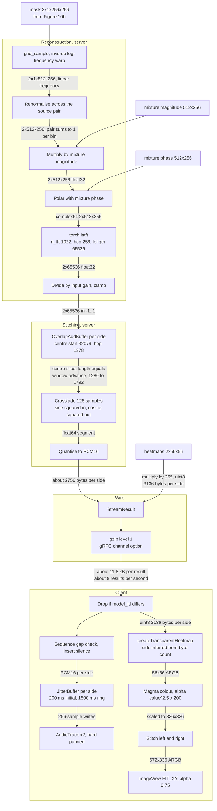

**The order of operations is load-bearing.** The mask is unwarped to the linear
frequency axis *first*, and only then renormalised across the source pair. The
two operations do not commute, because bilinear resampling and a pointwise
quotient are different kinds of operation; performing them in the other order
was measured, during the design of the touch mode, to diverge by up to 0.54 in
absolute mask value. The touch mode's region synthesis reproduces the deployed
order for exactly this reason.

**Renormalisation** divides each mask by the sum of both, clamped away from
zero by 10⁻⁸. It cannot amplify anything: each mask is non-negative and at most
the sum, so each quotient lies between zero and one, each output bin is at most
the mixture bin, and the two outputs sum to exactly the mixture. What it can do
is *redistribute*, and the effect is large where the two independent sigmoids
both undershoot.

**Only the centre of each window is ever heard.** The overlap-add buffer
extracts a slice beginning 32 079 samples into the 65 536-sample window. The
edges of the window — where the inverse transform is reconstructed from fewer
overlapping frames, and where the network has least context — are never
emitted. This is why an artefact at a window boundary does not become an
artefact in the output.

**On the client**, results whose echoed model identifier does not match the
current selection are dropped before anything else happens. A gap in sequence
numbers causes an estimated amount of silence to be inserted, so a lost result
shortens nothing: the audio timeline stays aligned with real time rather than
compressing. Audio then goes to the jitter buffers and the maps to the overlay
renderer.

### 7.5 The journey as a table

**Table 11 — Every transformation in the halves path, with shapes and rates.**
"Not measured" means exactly that.

| № | Stage | Input | Output | Rate |
|---|---|---|---|---|
| 1 | Camera sensor | — | YUV_420_888 1280 × 720 | ≈ 30 s⁻¹ |
| 2 | Analyzer throttle | 1280 × 720 | 1280 × 720 | 8 s⁻¹ |
| 3 | Colour conversion | YUV planes | ARGB 1280 × 720 | 8 s⁻¹ |
| 4 | Rotation | ARGB 1280 × 720 | ARGB, rotated | 8 s⁻¹ |
| 5 | Split at half width | 1280 × 720 | 2 × 640 × 720 | 8 s⁻¹ |
| 6 | Scale smaller edge to 256 | 640 × 720 | 256 × 288 | — |
| 7 | Centre crop | 256 × 288 | 224 × 224, origin (16, 32) | — |
| 8 | JPEG quality 90 | 224 × 224 | bytes, size not measured | 16 images s⁻¹ |
| 9 | Microphone read | — | 5512 samples PCM16, 11 024 B | 8.0 s⁻¹ |
| 10 | Decimate ÷ 4, 121-tap FIR | 5512 @ 44100 Hz | 1378 @ 11025 Hz, 2756 B | 8.0 s⁻¹ |
| 11 | Network uplink | chunks | chunks | ≈ 16 s⁻¹ |
| 12 | Integer to float | 1378 int16 | 1378 float32 | — |
| 13 | Audio ring | — | ≤ 165 375 float32 | 15 s capacity |
| 14 | Window extraction | ring | 65 536 float32, 5.944 s | ≈ 8 s⁻¹ |
| 15 | Level normalisation | 65 536 | 65 536, gain applied | — |
| 16 | STFT, 1022/256, Hann | 65 536 | complex64 512 × 257 | — |
| 17 | Slice and split | 512 × 257 | magnitude 512 × 256, phase 512 × 256 | — |
| 18 | Log-frequency warp | 1 × 1 × 512 × 256 | 1 × 1 × 256 × 256 | — |
| 19 | Logarithm | 1 × 1 × 256 × 256 | 1 × 1 × 256 × 256 | — |
| 20 | U-Net 7 | 1 × 1 × 256 × 256 | 1 × 32 × 256 × 256 | — |
| 21 | Frame tensor | 6 images 224 × 224 | 2 × 3 × 3 × 224 × 224 | — |
| 22 | Dilated ResNet-18 | 2 × 3 × 3 × 224 × 224 | 2 × 32 × 3 × 14 × 14 | — |
| 23 | Max pool over T, H, W; sigmoid | 2 × 32 × 3 × 14 × 14 | 2 × 32 | — |
| 24 | Inner-product synthesizer | 2 × 32 and 2 × 32 × 256 × 256 | 2 × 1 × 256 × 256 | — |
| 25 | Sigmoid | 2 × 1 × 256 × 256 | mask, warped | — |
| 26 | Inverse warp | 2 × 1 × 256 × 256 | 2 × 512 × 256 | — |
| 27 | Renormalise across the pair | 2 × 512 × 256 | 2 × 512 × 256, sums to 1 | — |
| 28 | Multiply by magnitude | 2 × 512 × 256 | 2 × 512 × 256 | — |
| 29 | Polar with mixture phase | magnitude and phase | complex64 2 × 512 × 256 | — |
| 30 | ISTFT, length 65 536 | 2 × 512 × 256 | 2 × 65 536 float32 | — |
| 31 | Undo gain, clamp | 2 × 65 536 | 2 × 65 536 in −1…1 | — |
| 32 | Overlap-add centre slice | 2 × 65 536 | ≈ 1378 samples per side | ≈ 8 s⁻¹ |
| 33 | Quantise to PCM16 | float64 | ≈ 2756 B per side | — |
| 34 | Localization: max over T, sigmoid | 2 × 32 × 3 × 14 × 14 | 2 × 32 × 14 × 14 | — |
| 35 | Pixelwise synthesizer | 2 × 32 × 14 × 14 | 2 × 14 × 14 × 256 × 256 | — |
| 36 | Sigmoid, mean over spectral axes | 2 × 14 × 14 × 256 × 256 | 2 × 14 × 14 | — |
| 37 | Per-side min-max normalise | 2 × 14 × 14 | 2 × 14 × 14 in 0…1 | — |
| 38 | Bilinear interpolate | 2 × 14 × 14 | 2 × 56 × 56 float32 | — |
| 39 | Quantise to uint8 | 2 × 56 × 56 | 3136 B per side | — |
| 40 | Serialize, gzip level 1 | fields | ≈ 11.8 kB before compression | ≈ 8 s⁻¹ |
| 41 | Jitter buffer | PCM16 | 256-sample writes | real time |
| 42 | Playback | PCM16 | analogue, 11025 Hz, two panned tracks | real time |
| 43 | Overlay render | 2 × 3136 B | 672 × 336 ARGB | ≈ 8 s⁻¹ |

### 7.6 The touch-mode path

Touch mode replaces stages 23 to 39 with a cache-and-query structure, and is
the reason the linear synthesizer described in Section 2.3 matters
architecturally.

**Once per window**, the two expensive networks run exactly as in stages 20 and
22, but on three whole letterboxed frames rather than six half-frames. Five
tensors are then retained: the audio features at 1 × 32 × 256 × 256, the
temporally maximum-pooled and sigmoid-activated visual features at
1 × 32 × 14 × 14, the linear mixture magnitude and phase at 512 × 256 each, and
the scalar input gain. At four bytes per element that is 8 388 608 + 25 088 +
524 288 + 524 288 = **9 462 272 bytes, about 9.46 MB per window**; a ring of
three holds about 28 MB, and a frozen window pins one additional slot.

**Also once per window**, all 196 cells are evaluated in seven batches of
twenty-eight, producing three quantities in one pass: a linear-domain energy
per cell, the warped-domain activation per cell that the halves mode uses as
its heatmap, and a 256-dimensional per-cell sound descriptor formed by average
pooling each cell's mask to sixteen frequency bands by sixteen time bins and
normalising. The energy map is contrast-normalised by subtracting the
per-window median — the background sigmoid gives every cell a substantial
fraction of the peak, so a raw map glows uniformly — then smoothed with an
exponential moving average and quantised against a slowly released peak hold,
which is what lets silence decay to black instead of lingering.

**Per query**, the answer costs one pooled vector, one inner product, one
sigmoid, one inverse warp, one renormalisation against the complement, one
multiplication by the magnitude and one inverse transform. No network runs. The
region's visual vector is formed by taking the **maximum** over the cells whose
weight exceeds one half; because those features are already post-sigmoid and
the sigmoid is monotonic, a regional maximum is exactly the deployed
video-level pooling restricted to that region, which keeps the comparison
between the two modes a one-variable experiment.

Before synthesising, the server checks the tapped cells against the same
contrast threshold the clustering uses; if none clears it, the answer is an
explicit zero-energy result rather than the roughly-40-percent-of-everything
leakage that a background sigmoid would otherwise produce. The returned audio
is the last 2.0 seconds of the window, not the whole window — a full replay was
reported as sounding like listening to the past twice.

### 7.7 The speech path

The speech path differs from Section 7.3 onward in seven ways, all consequences
of a different model rather than a different pipeline:

1. The device sends one letterboxed full frame at thirty frames per second and
   audio decimated by two to 22050 Hz.
2. The window is 46 352 samples at the wire rate, 2.1021 seconds, and the hop
   is 5512 samples, 250 milliseconds. Early inference is disabled.
3. Frame selection is sixty-three *consecutive* frames spanning the window, not
   a centred triple.
4. The engine resamples the window from 22050 to 21000 Hz with an exact 20 : 21
   polyphase filter, normalises it to a root-mean-square of 0.1414, duplicates
   the mono signal into two channels, and stacks the frames into one
   1 × 63 × 224 × 224 × 3 unsigned-byte tensor.
5. The TensorFlow graph computes its own transform internally — 1344-sample
   frames, 336-sample hop, 2048-point transform, 1024 retained bins, 128 time
   steps — and returns separated foreground and background waveforms together
   with an 8 × 7 × 7 alignment map, all from a single session run.
6. The map is reduced by clamping negatives to zero and averaging over the
   eight time steps, normalised by a smoothed running maximum, and resized to
   56 × 56 so that it rides the same wire format. The raw positive fraction is
   computed *before* the clamp and shipped as the confidence.
7. The separated audio is divided by the input gain, resampled back to
   22050 Hz, and returned at the wire rate, where it enters the same
   overlap-add machinery as every other mode.

---

## 8. Model integration

### 8.1 Sound of Pixels

**Input adaptation.** The reference evaluation transform resized each crop's
shorter edge to 256 and centre-cropped 224. That transform has been moved to
the device, so what crosses the network is already the exact 224 × 224 the
network consumes, and the server's remaining transform is only tensor
conversion and channel normalisation with the ImageNet statistics. The audio
side needs no adaptation: the client already decimates to the model's own
11025 Hz.

**Window and hop.** The window is the 65 536 samples the separation was trained
at. The hop is the frame interval, 1378 samples, which makes consecutive
windows overlap by 97.90 %. That overlap is far more than reconstruction
requires and is a direct consequence of pacing windows by frame arrival; its
benefit is a smooth 8 Hz map update, and its cost is that almost the same audio
is analysed eight times a second.

**Output adaptation.** Two adaptations happen after the network. Renormalising
the mask pair restores the partition property that two independent sigmoids do
not guarantee. Undoing the input gain restores the microphone's level. Both are
described in Section 7.4.

**Constraints this model imposes.** Three frames per window, so the temporal
context is 250 milliseconds even though the audio context is 5.9 seconds. A
14 × 14 feature grid, so no spatial query can be finer than one sixteenth of the
frame. And a five-second-scale window, which is the dominant term in the
latency budget (Section 9).

### 8.2 Locked constants, and why each is locked

The registry is deliberately hostile to tuning. The reason is not stylistic. On
this project, two "reasonable" parameter changes each produced output that was
confident, plausible-looking, and wrong — and in one case the wrongness
survived a correctness test and inverted its verdict.

**The window length, 2.135 seconds, is the important one.** The multisensory
graph derives its spectrogram length from the requested clip duration by a
formula that rounds a base-two logarithm: the spectrogram length is 128
multiplied by two raised to the rounded logarithm of the duration divided by
2.135. Only power-of-two multiples of 2.135 seconds are therefore coherent at
all, and the checkpoint was trained at one of them.

The evidence that this matters is the project's own decisive experiment. The
localization cross-check (Section 10.3) was first run at a duration of
4.27 seconds — a legitimate-looking power-of-two multiple. It produced a
confident **failure**, margin +0.0924, on a clip where the model should have
succeeded. Re-run at the default window on the identical clip at the identical
start time, the same test **passed** with margin +0.8248. The window was the
entire cause. Nothing in the output announced itself as broken: the separation
still ran, the map still had structure, and the only signature of being off the
training distribution was that the map's magnitude was roughly an order of
magnitude larger than normal — a maximum of 7.20 against 0.68.

That is the failure mode this whole design guards against. A parameter that
produces an obvious crash is cheap; a parameter that produces a plausible wrong
answer can invalidate a conclusion silently. Hence: the value is hard-coded in
the adapter, the adapter asserts at load time that the parameter module still
reports it, and the field is not exposed as a knob anywhere.

**The map resolution flag stays off.** Enabling it changes only the stride of
one convolution and yields a 14 × 14 map instead of 7 × 7. Measured against the
validated 7 × 7, the two have a spatial correlation of 0.0684 — essentially
unrelated — with incompatible band distributions and a meaningless peak under
masking. It also costs latency. The adapter refuses to load if it is set.

**The feature channel count is 32, not the paper's 16, and not the builder's
default of 64.** It is a property of the checkpoint. The synthesizer file on
disk is 652 bytes, which is consistent with 32 scale parameters plus one bias
and nothing else.

**The hop is set from measured inference time, not from taste.** At 142 to
148 milliseconds per window, the speech branch cannot sustain the halves
branch's 125-millisecond hop: it falls behind by roughly twenty milliseconds
per window and the lag compounds without bound. 250 milliseconds leaves the GPU
at roughly 57 to 59 % duty cycle with room for JPEG decoding, resampling and
transport, and still gives 8.4-fold overlap. The map updates at 4 Hz instead of
8 Hz, which is the price.

### 8.3 The alignment head is not a saliency map

The multisensory map is produced by applying the alignment classifier
convolutionally rather than after pooling. The separation loss never touches
that classifier, so it stays at its pretrained values. The consequence is that
its output is signed and has a meaning at both ends: strongly positive means
"this region's evidence supports the audio matching this video", and *uniformly
negative means the model is asserting the audio does not match anything on
screen*.

That is a useful answer, not a failure — but it is not a localization, and
rendering it as one would be a lie in the interface. The adapter therefore
computes the positive fraction of the raw signed map *before* any clamping, and
when it falls below 0.10 it withholds the map entirely and reports the fraction
on the wire. The client clears the overlay and shows an explicit "no confident
localization" state while continuing to play the separated audio.

The threshold's origin is the masking experiment: when the visible speaker was
masked out of the frame, the positive fraction collapsed to 0.038, which is the
regime the gate is designed to catch.

The reduction applied to the map when it *is* rendered reproduces the
validated offline tooling exactly — clamp negatives to zero, average over the
eight time steps, divide by the maximum — so that any live heatmap remains
directly comparable to the probe output that the measurement record was built
from. The only deviation is a smoothed divisor for display stability, and the
unsmoothed per-window values are still reported in the diagnostics so the
comparison stays exact.

One statistic is deliberately excluded from every decision: a "contrast" formed
as standard deviation over absolute mean. On a signed, near-zero-mean map that
quantity produces values in the hundreds and is an artefact of the near-zero
denominator, not a signal.

### 8.4 Touch mode on the same checkpoint

Touch mode adds no model. It exploits the property established in Section 2.3:
because the synthesizer is linear in the visual vector, every spatial selection
is the same operation with a different vector, and the vector is the only part
that depends on the selection.

The integration consists of retaining what would otherwise be discarded. The
deployed halves path computes the per-cell mask tensor and then explicitly
frees it; touch mode keeps a compact subset — the audio features, the pooled
visual features, the mixture magnitude and phase, and the gain — from which any
region's mask can be recomputed for the cost of one matrix product.

Three integration constraints follow, and all three are honoured:

- **The pooling rule must match.** Region pooling takes the maximum over the
  region's cells. Because the cached visual features are already
  post-sigmoid and the sigmoid is monotonic, a maximum over a region equals the
  deployed video-level pooling restricted to that region. Any other rule would
  make a comparison between the two modes a two-variable experiment.
- **The post-processing order must match.** Unwarp first, then renormalise
  across the region set, then optionally threshold — the deployed order, in the
  linear domain. The alternative order was measured to diverge by up to 0.54 in
  absolute mask value.
- **The gain state must not be shared.** The halves path smooths its input gain
  on the shared singleton. The pixel path keeps its own, so that a touch stream
  and a halves stream coexisting in one process cannot perturb each other's
  numbers.

### 8.5 Multisensory input and output adaptation

The adapter sits at a rate boundary and a format boundary. Inbound: resample
the window from the wire's 22050 Hz to the model's 21000 Hz with an exact
20 : 21 polyphase filter, normalise to the level the network expects, duplicate
mono into the two channels the graph's placeholder requires, and stack
sixty-three frames into one unsigned-byte tensor. Outbound: divide by the input
gain, resample back to 22050 Hz, and fit to the wire window length so the
overlap-add machinery — which runs entirely at the wire rate — needs no
knowledge that a different internal rate exists.

The separation and the map come from **one** session run. The map is a
convolution over a tensor the separation path already computes, so fetching it
costs one extra tensor in an existing evaluation rather than a second forward
pass. Folding the spectrogram fetch into the same run also removed a
pre-existing inefficiency in which the transform was computed twice per cycle.

---

## 9. Latency and performance

### 9.1 Two different quantities

**Algorithmic latency** is imposed by the analysis window and would exist on
infinitely fast hardware. A result describes the *centre* of its window, and
the window's trailing half must have arrived before the window exists at all.
The centre instant is therefore already half a window in the past when the
result becomes computable. No amount of computing power reduces this; only a
shorter window does.

**Processing latency** is imposed by computation and transport: buffering,
inference, reconstruction, serialisation, the network, and the client's jitter
buffer. It is reducible by faster hardware or a leaner path.

Conflating the two produces the wrong engineering response — for example,
optimising inference to reduce a latency that is dominated by a term
optimisation cannot touch. On the halves branch, algorithmic latency is roughly
twenty times the measured processing latency of the *other* branch; on the
speech branch it is roughly seven times.

**Figure 11 — Window, hop, overlap and latency composition, halves branch.**
Times are milliseconds from the start of window N. Three consecutive windows
are shown; each is 5944 ms long and each starts 125 ms after the last, so any
two consecutive windows share 97.90 % of their samples. Only the 125-millisecond
centre slice of each window is ever emitted. The algorithmic bar runs from the
centre instant to the moment the window is complete; the three bars after it are
processing terms, and the two marked "not measured" are drawn at nominal widths
purely to show composition order.

```mermaid
gantt
  dateFormat x
  axisFormat %Ss
  tickInterval 1second
  todayMarker off
  title Analysis windows, the emitted slice, and how latency composes

  section Analysis windows
  Window N, 65536 samples, 5944 ms      :done, wn,  0,    5944ms
  Window N+1, hop 125 ms later          :active, w1, 125,  5944ms
  Window N+2                            :active, w2, 250,  5944ms

  section What is heard
  Centre slice emitted from window N    :crit, cs, 2972, 125ms

  section Latency after the centre instant
  Algorithmic, half the window, 2972 ms :crit, alg, 2972, 2972ms
  Processing, server, not measured here :prc, 5944, 150ms
  Network and serialisation, not measured :net, 6094, 30ms
  Jitter buffer target, 200 ms          :jit, 6124, 200ms
```

### 9.2 The budget, decomposed

**Table 12 — Latency budget by stage.** Derived values follow arithmetically
from constants in the code. Measured values carry their conditions in
Section 9.3.

| Stage | Halves and touch | Speech | Status |
|---|---|---|---|
| Capture block period | 125.0 ms | 125.0 ms | derived |
| Frame period | 125 ms | 33 ms | derived |
| Device transform and JPEG encode | — | — | instrumented on device; no figure recorded |
| Network uplink | — | — | not measured |
| Server buffering to a complete window | — | — | not measured; logged per cycle |
| **Algorithmic latency (half the window)** | **2972.2 ms** | **1051.1 ms** | derived |
| Inference | — | 142.6 ms median | speech measured; halves not measured |
| Reconstruction and overlap-add | — | — | logged per cycle, floored at 1 ms; no figure recorded |
| Serialisation and gzip | — | — | not measured |
| Network downlink | — | — | not measured |
| Client jitter buffer target | 200 ms, adaptive to 500 ms | same | design constant |
| **Estimated total perceived** | **≈ 3.0 s** | **≈ 1.2 s** | **estimate, not a measurement** |
| Window overlap | 97.90 % | 88.11 % | derived |
| Map update rate | 8 Hz | 4 Hz | derived |
| Inference duty cycle against the hop | not measured | 57–59 % | derived from the measured inference time |

The two totals in bold are the values the client also uses to size its
buffering indicator. They are computed as roughly half the window plus
inference, not stopwatch measurements. The project's own test plan lists a
stopwatch check of exactly this quantity as an outstanding item.

**The counter-intuitive result** is that the speech branch, which uses the
slower and heavier model, has *less than half* the perceived latency of the
music branch — because its window is 2.1 seconds rather than 5.9, and window
length dominates.

### 9.3 Measured figures, with conditions

All figures in this subsection were measured on the following configuration and
recorded in the project handoff dated 2026-08-03. No figure below was
re-measured for this report; the machine this report was prepared on has
different hardware and no TensorFlow installation.

> **Conditions.** NVIDIA GeForce GTX 1660 Ti, 6 GB, driver 566.14 (CUDA 12.7).
> Host Windows; GPU runs measured inside WSL2, Ubuntu 26.04, Python 3.12,
> TensorFlow 2.21.0. Multisensory separation checkpoint, 2.135-second window,
> 44 144 samples at 21000 Hz, 63 frames. Input: a single video clip, the same
> clip and start offset across runs.

**Table 13 — Multisensory inference latency, ten runs.**

| Quantity | CPU, Windows | GPU, WSL2 |
|---|---|---|
| Steady-state median | 1991.0 ms | **142.6 ms** |
| Minimum / maximum | not recorded | 140.3 / 146.3 ms |
| Run-to-run jitter | not recorded | ≈ 1.5 % |
| Real-time factor against a 2102 ms window | 0.95× | **0.07×** |
| Headroom against the window | ≈ 5 % | ≈ 14× |
| First call | — | 4.2–4.5 s, cuDNN autotuning |

**Table 14 — Video memory against the cuDNN workspace cap.** Same conditions.
A separate run from Table 13, which is why the medians differ slightly.

| Workspace cap | Steady median | TensorFlow peak | Card used | Card free |
|---|---|---|---|---|
| uncapped (default) | 147.3 ms | 2884.0 MiB | 4901 MiB | 1243 MiB |
| **512 MB (shipped)** | **147.8 ms** | **1028.6 MiB** | **1866 MiB** | **4278 MiB** |
| 128 MB | 149.8 ms | 886.7 MiB | 1843 MiB | 4301 MiB |

Uncapped, cuDNN probes multi-gigabyte workspaces while choosing convolution
algorithms, the memory allocator grows its pool to match, and it never releases
it — 2.9 GB held for a working set of roughly 0.5 GB. Capping at 512 MB costs
no measurable time, since the minimum and maximum ranges overlap, and returns
about three gigabytes. Capping at 128 MB buys a further 23 MiB for two
milliseconds, which is a bad trade.

**Sound of Pixels inference time is not recorded anywhere in this working
tree.** The server measures and logs it per cycle and warns when the whole
cycle exceeds 140 milliseconds, which implies a working assumption below that,
but no summary statistic exists. This is a gap, not an omission from this
report.

### 9.4 Memory footprint

**On disk.** The three PyTorch checkpoints total about 158.8 MiB: the sound
network 121 145 339 bytes, the frame network 45 356 134 bytes, and the
synthesizer 652 bytes. The multisensory separation checkpoint is about
1.27 GiB in its data file plus 13.0 MB of graph metadata and 25.5 kB of index.

**Server, per process.** Both frameworks' CUDA contexts and kernel images cost
roughly one to 1.3 gigabytes before any weights are loaded, which is precisely
why the design keeps them in one process. The measured TensorFlow-only
footprint is in Table 14. **The combined footprint with both frameworks
resident has never been measured**, and it is the single largest unquantified
risk in the deployment (Table 1, item 8).

**Server, per stream.** The audio ring is 165 375 single-precision samples,
about 662 kB. The frame ring holds decoded images: sixty entries of two
224 × 224 RGB images is about 18.1 MB for the halves profile, and ninety
entries of one image about 13.5 MB for the speech profile. The two overlap-add
buffers hold one window each in double precision plus a 128-sample tail.

**Server, per stream, touch mode only.** The window cache holds four tensors:
1 × 32 × 256 × 256 audio features at 8 388 608 bytes, 1 × 32 × 14 × 14 visual
features at 25 088 bytes, and a 512 × 256 magnitude and phase at 524 288 bytes
each. That is **9 462 272 bytes, about 9.46 MB per window**; a ring of three is
about 28.4 MB and a frozen window pins one more, giving about 37.8 MB. The
per-cell analysis allocates transient tensors for twenty-eight cells at a time
rather than for all 196 at once, which is what keeps that pass inside a
reasonable working set.

**Client.** Each jitter buffer ring is 1500 milliseconds, which is exactly
33 075 bytes at 11025 Hz — the same figure the server's oversized-drain cap is
sized against.

### 9.5 Throughput

The uplink carries about sixteen messages per second on the halves and touch
profiles and about thirty-eight on the speech profile. The downlink carries
about eight results per second on the halves and touch profiles and about four
on the speech profile. A halves result is about 11.8 kB before compression: two
audio payloads of roughly 2756 bytes and two maps of 3136 bytes each. A touch
result is far smaller — one audio payload plus 196 bytes of energy map and at
most 196 bytes of cluster labels — but a query answer adds 44 100 bytes of PCM.
gzip at its lowest level is applied to everything.

---

## 10. Validation

### 10.1 What exists, and what it proves

Four bodies of evidence exist. They are not equally strong, and the difference
matters.

| Body of evidence | What it can prove | Status |
|---|---|---|
| The multisensory migration harness, stages T0 to T5 | That a Python 2 to Python 3 port computes the same function as the released model | Harness implemented; **no result artefacts recorded in this working tree** |
| The localization cross-check | That the map actually tracks the visible speaker, by a test designed to fail if it did not | Run; result recorded |
| CPU versus GPU equivalence | That the GPU port is numerically sound | Run; result recorded |
| The backend unit suite | Shapes, orders, contracts, and instance-state isolation | Run for this report; result below |
| The integration test plan, stages T1 to T8 | Everything built on top of the models | **Written; not run** |

Note that two independent stage-numbering schemes exist in this project. The
T0–T5 series belongs to the multisensory repository's migration harness. The
T1–T8 series belongs to the backend's integration test plan. They are unrelated.

### 10.2 The migration harness, T0 to T5

The harness was built to test one claim — that a port from Python 2.7 runs and
computes the same function — against the observation that the original evidence
for that claim was a syntax check, which only proves a file parses.

- **T1, static audit.** Scans for the four break classes a syntax check cannot
  see: removed builtins, moved builtins, iterator-versus-list changes, and
  classic-versus-true division. Exits non-zero on a certain failure, so it can
  run in continuous integration. Proves absence of a specific class of defect.
- **T0, smoke test.** Imports every module — which a syntax check never does —
  and runs the repository's four documented commands. Distinguishes *crashes*
  from *runs*. Proves nothing about correctness.
- **T2, the pretext self-oracle.** The decisive stage, and the only one that
  needs no reference implementation. The network was trained so that aligned
  audio scores higher than time-shifted audio; that objective is a built-in
  oracle. Feed the same frames with aligned and with shifted audio and count
  which scores higher. Approximately 50 % means the checkpoint loads, the code
  runs, and the network computes noise — which is exactly the failure mode that
  padding, batch-normalisation and pooling bugs produce, and exactly the failure
  mode T0 cannot see. Significantly above chance means the graph is wired
  correctly.
- **T3 and T4, layer-wise diff.** T3 dumps activations from both the migrated
  stack and a pinned TensorFlow 1.8 container built from a Dockerfile in the
  repository, with byte-identical frozen inputs. T4 compares them in forward
  order and names the *first* divergence, so the answer is "broke at this
  layer" rather than "the outputs are wrong".
- **T5, task-level numbers.** Reproduce the published separation and
  classification figures.

**What is recorded in this working tree:** the harness scripts, the pinned
reference Dockerfile, and two log files, one of which contains only the string
`ALL GOOD`. The activation dumps, the smoke-test log, and any T2 accuracy
number are **not present**. This report therefore records the harness as
implemented and its results as unrecorded here.

### 10.3 The localization cross-check

This is the strongest single piece of evidence in the project, because it was
designed so that a wrongly wired model would fail it.

**The question.** Does the map from the separation network actually localize the
on-screen speaker, or does it merely look plausible?

**The method.** Reproduce the masking demonstration from the multisensory paper.
Take a clip of two men against a brick wall, both speaking, the right-hand one
dominant. Run it three times: unmasked, with the left half of every frame
greyed out, and with the right half greyed out. If the visible half of the
frame really controls which voice lands in the foreground, then the two masked
runs must agree **crosswise** — the foreground of one run must match the
background of the other — and must *not* agree directly.

**The result.**

| Metric | Baseline | Left half masked | Right half masked |
|---|---|---|---|
| Foreground / background RMS ratio | 1.398 | **1.552** | **0.642** |
| Positive fraction of the raw map | 0.528 | 0.793 | **0.038, collapsed** |
| Peak cell of the positive map | (4, 4) | (4, 4) | (2, 5), meaningless |
| Left / right mass of the map | — | 20.8 % / 79.2 % | 24.8 % / 75.2 % |

| Correlation | Value |
|---|---|
| Cross: foreground of run A against background of run B | +0.9933 |
| Cross: background of run A against foreground of run B | +0.9848 |
| Direct: foreground against foreground | +0.1498 |
| Direct: background against background | +0.1787 |
| **Cross mean minus direct mean (the margin)** | **+0.8248** |

The verdict thresholds fixed in advance were: above +0.30 pass, above +0.10
weak pass, above −0.10 fail, otherwise inverted. The result is a pass by a wide
margin. The mapping is inverted relative to naive expectation — masking the
*left* half puts the *right* speaker in the foreground — which is itself
consistent with the model attributing the foreground to what remains visible.

Two independent observations corroborate it. The energy is loud when the
dominant speaker is visible and quiet when only the other one is, matching the
ratios above. And an unaided listener confirmed that both men speak, that the
right-hand one dominates, and that the two separated tracks sound like
different people.

The collapse of the positive fraction to 0.038 in the right-masked run is the
behaviour described in Section 8.3 and is the empirical basis for the
confidence gate.

### 10.4 CPU versus GPU numerical equivalence

Three independent runs produced output identical to every digit printed.

| Metric | CPU | GPU |
|---|---|---|
| Foreground / background RMS | 0.15428 / 0.09938 | 0.15428 / 0.09938 |
| Raw map minimum / maximum / standard deviation | −0.32998 / 0.82421 / 0.17237 | −0.32998 / 0.82421 / 0.17238 |
| Positive fraction | 0.793 | 0.793 |
| Peak cell | (4, 4) | (4, 4) |
| Cross-check margin | +0.8248 | +0.8248 |

The single differing digit is one unit in the last place of a single-precision
accumulation, which is the expected consequence of a different summation order.
The port is sound.

### 10.5 The unit suite

Executed for this report on 2026-08-05.

> **Conditions.** Windows 11, Python 3.11.9, PyTorch 2.6.0 with CUDA 12.4,
> NumPy 2.3.5, grpcio 1.78.0, NVIDIA GeForce GTX 1650 4 GB, driver 595.97.
> TensorFlow **not** installed. Sound of Pixels checkpoints present;
> multisensory checkpoints present but unusable without TensorFlow.

Result: **66 passed, 1 skipped, 2 collection errors**, in 32 seconds.

| Test module | Tests | Covers |
|---|---|---|
| `test_pixel_cache` | 18 | Region weights, region pooling against a brute-force reference, the renormalisation partition property, cache ring and pinning, energy-map smoothing |
| `test_model_registry` | 13 | Every specification constant, registry lookup, engine caching, loaded-model reporting |
| `test_clustering` | 12 | Silence gate, k-means determinism, track persistence, identifier recycling, colour assignment |
| `test_multisensory_engine` | 10 | Specification constants, resampler length and tone preservation, map reduction and normalisation semantics, wire encoding |
| `test_overlap_add_buffer` | 9 | Timeline contract, crossfade alignment, gap and lag counters, flush |
| `test_stream_model_branch` | 3 | Unknown model rejected, unloaded model rejected, absent metadata defaults |
| `test_inference_grpc` | 1 | One-shot result structure and heatmap shape |
| `test_preprocessor` | 1 | Preprocessing outputs |
| `test_grpc_client` | — | **Not a test module.** A manual script whose functions are named `test_*`, so the runner collects them and fails on a fixture that does not exist. This is the source of both collection errors. |

The skip is a test that only runs in an environment *without* the multisensory
checkpoint, which is not this one.

What the suite proves is shapes, orders and contracts. What it cannot prove is
that the models produce good audio. No test in it listens to anything.

### 10.6 What has not been validated, and why

- **The registry refactor's numerical neutrality.** The claim that moving the
  Sound of Pixels path behind a registry changed nothing numerically has a
  written gate — replay a fixed clip through a pre-refactor and a post-refactor
  server and compare bytes — that has never been run. The gate itself is
  complicated by three sources of run-to-run non-determinism already present in
  the pipeline: cuDNN autotuning, mixed precision, and the process-lifetime
  moving averages. The plan's honest fallback is to compare both against the
  baseline's own run-to-run delta.
- **The multisensory adapter against the validated probe.** Never run. It is
  the difference between "the model works" and "our wiring of the model works".
- **Both models resident in one process.** Never measured (Section 9.4).
- **Any end-to-end behaviour on a device.** The mobile gates — model switching,
  playback rate correctness, memory across repeated switches, the encode-rate
  measurement at thirty frames per second, first-result latency by stopwatch —
  are all written and none is recorded as run.
- **Touch mode's numeric gates.** A live session on 2026-08-05 clearly
  happened: it produced the energy-percentile observations and the tap-length
  change now in the code, both dated. But the written gate — a live query
  against an offline reference on the same clip and cell — and the entire
  timing and memory table remain unfilled.
- **Separation quality against any benchmark.** No signal-to-distortion figure
  was computed by this project on any dataset. Every decibel figure in this
  report comes from the published papers.

---

## 11. Limitations and known issues

### 11.1 Domain limits

**The music model is a music model.** Its checkpoint was trained on solos and
duets of eleven instrument categories. A source that is not a visibly played
instrument — a loudspeaker, a passing vehicle, a voice — is outside its training
distribution, and the model has no way to report that. It will still produce two
masks that sum to the mixture and a map that has structure.

**The speech model is a speech model.** Its separation head was fine-tuned on
speech video. Its features are more general, coming from an alignment task
trained on a broad collection of unlabelled video, so its *localization* is
plausibly more transferable than its *separation*. Separation quality on music
is unverified.

**Neither model has a competence estimate.** Only the speech branch can say "I
cannot localize this", and even that says nothing about separation quality. The
music branch has no equivalent signal at all.

**The failure mode of the deployed pooling.** With the shipped configuration,
two visually similar regions produce visually similar feature vectors — measured
cosine similarity between 0.85 and 0.98 for two crops of "a musician in a
room" — and since the synthesizer is an inner product with unit-scale
parameters, similar vectors give similar masks, which after renormalisation is
an even split. The code implements the paper's prescribed test-time alternative
behind an environment variable but does not ship it.

### 11.2 Coarse localization

The music model's spatial resolution is 14 × 14 cells over a 224-pixel square,
so one cell covers sixteen pixels of model input. In touch mode with a
letterboxed 16:9 frame, only rows three to ten carry scene content, so roughly
112 of the 196 cells are live. The interface deliberately draws a tapped
*cell*, not a crosshair, so that its precision claim matches the model's.

The speech model's map is coarser still: 7 × 7 over eight time steps.

The published human evaluations recorded in this project's own reference notes
put the localization and separation quality in perspective: for the music model,
listeners identified the correct instrument in 59.11 % of binary-mask examples
against 39.19 % for ratio masks, and per-channel category accuracies of 46.2 %
and 68.9 % are recorded; for the speech model, alignment accuracy is 59.9 %
against a human baseline of 66.6 ± 2.4 %, and on/off-screen separation is
reported at 11.4 dB and 7.0 dB. **These figures were transcribed from the
project's reference notes and were not re-verified against the papers for this
report**; the author lists, venues and identifiers in the References section
were verified.

The binary-versus-ratio result is a genuine unresolved tension. Binary masks
are heard as cleaner, but they destroy the partition property on which the
touch mode's mixer semantics depend. The project's own position is that ratio
masks stay the default and the binary variant is an audition mode worth
testing — a decision explicitly deferred pending a listening test that has not
happened.

### 11.3 Latent and environment-dependent issues

**Portrait field of view.** The halves transform scales each half's *smaller*
edge to 256 before cropping 224. In landscape at 1280 × 720 each half is
640 × 720 and the crop keeps 87.5 % of the width and 77.8 % of the height. In
portrait at 720 × 1280 each half is 360 × 1280, scales to 256 × 910, and the
crop keeps rows 343 to 566 — **24.6 % of the vertical field of view**, a narrow
horizontal band. This is confirmed by arithmetic and **cannot occur in the
shipped application**, because the activity is locked to sensor-landscape in
the manifest. It is latent: it becomes live the moment that lock is lifted.

**Server placement.** The single-process rule plus TensorFlow's lack of native
Windows GPU support means the production server belongs in WSL2, from which the
phone cannot reach it without mirrored networking or a port-forwarding rule.
This has never been exercised with both models loaded.

### 11.4 Defects found while preparing this report

None of these were fixed; this task was read-only with respect to the
codebases. They are recorded here and were reported separately.

| # | Where | Issue |
|---|---|---|
| 1 | Android capture | Two raw microphone WAV files are written to the application's external files directory on **every** session, unconditionally — no debug flag, no size cap, no cleanup. See Section 12. |
| 2 | Android lifecycle | There is no `onPause` or `onStop` handler. Backgrounding the application does not stop camera or microphone capture, or the stream. |
| 3 | Server, halves loop | The oversized-drain safety cap is computed from the module-level 11025 Hz constant instead of the stream's own output rate, so on the 22050 Hz speech branch the intended 1.5-second cap is actually 0.75 seconds. The touch loop computes it correctly from the specification. |
| 4 | Server, halves loop | The overlap-add centre offset for early-mode windows is computed and then unreachable: the early-mode guard returns before it is used. Dead code that suggests a behaviour that does not occur. |
| 5 | Protocol comments | Five divergences between comment and code, tabulated in Section 6.4. Two of them — the speech branch's output sample rate and the query answer's length — would mislead an implementer working from the comments. |
| 6 | Backend tests | `tests/test_grpc_client.py` is a manual script whose functions are named `test_*`. A plain run of the suite reports two collection errors that are not real failures, which trains readers to ignore errors. |
| 7 | Android capture | Colour conversion round-trips the frame through the JPEG codec at quality 100 purely to obtain an ARGB bitmap, before the real encode at quality 90. |
| 8 | Server, shared state | Two concurrent streams on different non-pixel models share the input-gain moving average on the singleton. The touch path was given a private one; the other two were not. |
| 9 | Server | Dead imports and constants: a timing helper and one configuration constant are imported and never used; the loss classes reachable through the models package are training-only. |
| 10 | Protocol | `frame_width` and `frame_height` are documented as required and are never read by the server. |
| 11 | Documentation | The backend test plan states that touch mode is unmeasured below the unit level; code comments record a live session on 2026-08-05 that produced the shipped silence-gate constants and changed the tap length. One of the two is out of date. |

### 11.5 The unvalidated integration surface, restated

The models are the best-evidenced part of this system and the integration is
the least-evidenced. Table 1 says so per capability, Section 10.6 lists the
specific gates. The summary is that a reader should treat "the multisensory
model localizes correctly" as established and "the SonicSight server serves the
multisensory model correctly" as unproven.

### 11.6 Where existing documentation contradicts the code

For the record, and because this report was required to follow the code:

- A project brief describes touch mode as a Phase 0 plan with no
  implementation. The code implements it (Table 1, item 6).
- The same brief cites the protocol comment claiming a 24 × 24 streaming map
  and a backend README pointing at a `proto/` directory. Both were true
  historically; the current protocol file says 56 × 56 and the current README
  names the file at the repository root. They are no longer divergences.
- The project handoff instructs the adapter to resample the speech map to
  24 × 24. The shipped wire format is 56 × 56 and the adapter emits that.
- The handoff's capture-profile summary states the streaming heatmap is
  24 × 24 unsigned bytes. It is 56 × 56.
- The handoff lists work to delete — gating masks, sidecar services on two
  ports, a dual-GPU split. None of it exists in any of the three repositories.
- The backend test plan's touch-mode section contradicts the code's own dated
  calibration comments (Section 11.4, item 11).

---

## 12. Security and privacy considerations

### 12.1 The posture, stated plainly

**The transport is plaintext and the endpoint is unauthenticated.** The server
binds an insecure port; the client opts into plaintext explicitly and the
application manifest permits cleartext traffic. There is no transport-layer
security, no certificate on either side, no token, no credential, and no
per-client identity of any kind.

The consequence is exact and worth writing without hedging: **anyone with
access to the same local network can read the camera frames and the microphone
audio in the clear, can inject or modify results, and can impersonate the
server.** The client also cannot detect that it is talking to a different
server than intended.

This is a *trusted-LAN* posture. It is a legitimate choice for a system
developed and demonstrated on a private network, and it is the posture that
actually exists. It is not suitable for use over any network the operator does
not control, and moving this system onto a shared or public network would
require transport security and endpoint authentication as a precondition,
not as an improvement.

### 12.2 The trust boundary

Figure 1 marks it. Inside the device, media is under the operating system's
application sandbox. The moment a chunk is written to the socket it is exposed
to every host on the local network segment. On the server it is held in memory,
processed, and — under the default configuration — not written to disk.

### 12.3 What is persisted, and where

**Server side, by default: nothing.** The one-shot upload path writes the
uploaded file and its extracted frames and audio to a temporary directory and
removes that directory in a `finally` block whether the request succeeded or
failed; the REST endpoint schedules the same cleanup as a background task after
the response. The streaming path holds audio and frames only in bounded
in-memory rings.

**Server side, when explicitly enabled:** setting the stream-dump variable
records, for one session, the raw microphone audio as received, an
identity-mask control track, the exact PCM sent to the client, several complete
model windows, and two CSV logs. This is off by default, is buffered in memory
and written at stream end, and its destination is configurable.

**Device side, always:** two WAV files are written per session — the raw
44100 Hz capture before the client's filter, and the decimated audio exactly as
sent — into the application's external files directory, named with a
timestamp. This is **not** behind a flag, has no size limit, and nothing
deletes them. A session therefore leaves a complete recording of everything the
microphone heard on the device's shared storage. The class is documented as
diagnostic-only, and its call sites are unconditional.

Two aggravating factors: the application declares backups enabled and ships the
unmodified template backup rules with every rule commented out, so the platform
default applies and the application's external files are within the scope of
Android's automatic backup; and there is no `onPause` or `onStop` handler, so
backgrounding the application leaves capture and dumping running.

Neither of these is exotic. Both are the kind of finding that a report of this
sort exists to surface.

### 12.4 Permissions

The application requests the camera, microphone, and internet permissions, plus
legacy external-storage write on API 28 and below. Camera and microphone are
requested at run time together, and the application exits if either is refused.
The external files directory it writes to needs no run-time permission, which
is precisely why the dumping is invisible to the user.

### 12.5 Server-side exposure

The gRPC service accepts any connection on any interface and, before checking
anything else, allocates buffers for messages up to sixteen megabytes. The
one-shot upload path writes attacker-controlled bytes to a temporary file up to
that limit per chunk, bounded by a two-minute total timeout and a thirty-second
inactivity timeout, and shells out to FFmpeg over the result. The REST endpoint
caps uploads at one hundred megabytes and permits any origin. None of this is
exploitable in the intended deployment; all of it is reachable by anyone on the
network.

---

## 13. Future work

Two categories, kept separate because one is a plan and the other is a decision
awaiting evidence.

### 13.1 Designed, not implemented

**Additional region modes.** Thirds, quadrants and freeform selection are, in
this architecture, *new weight generators* rather than new architecture. A fixed
geometry needs only a server-side mask builder beside the existing disc
generator plus a registry and profile entry. A freeform selection would add one
protocol field — a grid-shaped weight map in the client's letterbox space —
feeding the existing region synthesis unchanged. Explicitly out of scope at
present.

**A principal-component ambient colour layer.** Reduce the per-cell sound
descriptors to three dimensions and render them as a continuous colour field
over the scene, giving an always-on impression of the sound's spatial
structure rather than discrete cluster dots. Noted as a natural extension.

**A PyTorch port of the multisensory model.** A port skeleton exists in the
upstream repository — network definitions, datasets, losses, training loops, an
inference script and a weight-conversion script — with **no checkpoint of any
kind**. Nothing in it is loadable and nothing in this system depends on it. The
server deliberately uses the TensorFlow path because that is the path the
measurement record was built on. Completing the port would remove the
TensorFlow dependency, and with it the WSL2 deployment constraint, at the cost
of re-establishing the entire measurement record against the ported weights.

### 13.2 Decisions awaiting a listening test

Three questions are framed, instrumented, and unanswered. An offline harness
exists that renders all three from a fixed clip without a server.

- **Crop halves versus region halves.** Whether the deployed left/right
  behaviour should keep using two independently cropped halves or be derived as
  two regions of one letterboxed full frame. This cannot be settled by
  arithmetic: the two see different pixels, because a crop and a letterbox
  capture different fields of view — in portrait the full frame sees roughly
  four times as much scene — and additionally the deployed path pools at video
  level while region pooling pools per-cell features. Any write-up must say
  that two things change at once.
- **Ratio versus binary masks.** Section 11.2. One environment variable apart.
- **Energy map versus activation map.** The touch mode ships a linear-domain
  energy map, which is the paper-faithful quantity and matches what is audible.
  The warped-domain activation map is the only one ever validated on a device.
  Both are computed in the same pass so they can be compared side by side
  before one is chosen.

### 13.3 Outstanding validation

Everything in Section 10.6. In priority order: measure video memory with both
models resident, because it gates the whole deployment; run the multisensory
adapter against the validated probe, because it is the difference between a
validated model and a validated system; then the byte-identical regression gate
and the device-level gates.

---

## 14. Development tooling and environment

### 14.1 Versions, read from the manifests

**Table 15 — Backend Python dependencies**, as declared. Note that the
declarations are lower bounds, not pins, so a fresh installation does not
reproduce a known-good set.

| Package | Declared |
|---|---|
| torch | ≥ 2.0.0 |
| torchvision | ≥ 0.15.0 |
| fastapi | ≥ 0.100.0 |
| uvicorn | ≥ 0.20.0 |
| python-multipart | ≥ 0.0.6 |
| numpy | ≥ 1.24.0 |
| pillow | ≥ 10.0.0 |
| scipy | ≥ 1.10.0 |
| moviepy | ≥ 1.0.3 |
| opencv-python | ≥ 4.8.0 |
| imageio-ffmpeg | ≥ 0.4.9 |
| grpcio | ≥ 1.60.0 |
| grpcio-tools | ≥ 1.60.0 |
| protobuf | ≥ 4.25.0 |
| python-dotenv | ≥ 1.0.0 |
| librosa | ≥ 0.10.0 |
| soundfile | ≥ 0.12.0 |
| TensorFlow | **deliberately absent**; the file records why |

**Table 16 — Android toolchain and dependencies**, from the version catalogue
and the module build script.

| Component | Version |
|---|---|
| Gradle wrapper | 8.13 |
| Android Gradle plugin | 8.13.2 |
| Kotlin | 2.0.21 |
| Protobuf Gradle plugin | 0.9.4 |
| compileSdk / targetSdk / minSdk | 36 / 36 / 28 |
| Java source and target compatibility | 11 |
| CameraX (core, camera2, lifecycle, video, view, extensions) | 1.3.1 |
| kotlinx-coroutines-android | 1.7.3 |
| Lifecycle ViewModel and runtime | 2.6.2 |
| gRPC (okhttp, protobuf-lite, stub) | 1.62.2 |
| gRPC Kotlin stub and generator | 1.4.1 |
| Protobuf (kotlin-lite, protoc, javalite) | 3.25.3 |
| AndroidX core-ktx / appcompat / activity / constraintlayout | 1.17.0 / 1.7.1 / 1.12.3 / 2.2.1 |
| Material components | 1.13.0 |
| Media3 ExoPlayer, UI, common | 1.2.0 |
| Zoomage | 1.3.1 |
| JUnit / AndroidX JUnit / Espresso | 4.13.2 / 1.3.0 / 3.7.0 |

Stubs are generated in lite mode for Java, Kotlin, gRPC-Java and gRPC-Kotlin.

**Table 17 — Multisensory environment**, from the recorded validation
configuration and the repository's own notes.

| Component | Version |
|---|---|
| GPU | NVIDIA GeForce GTX 1660 Ti, 6 GB |
| Driver | 566.14, CUDA 12.7 |
| Host | Windows; GPU work inside WSL2 |
| Distribution | Ubuntu 26.04 LTS |
| Python | 3.12, installed via `uv` |
| TensorFlow | 2.21.0 with the CUDA extra |
| Also required | tf_keras, tf_slim, numpy, scipy, matplotlib, Pillow, ffmpeg-python |
| System packages | ffmpeg, libsm6, libxext6, libgl1 |
| Reference container for the layer-wise diff | `tensorflow/tensorflow:1.8.0-py3`, with numpy 1.14.5, scipy 1.1.0, pillow 5.2.0, matplotlib 2.2.3, all pinned |

**Table 18 — The machine this report was prepared on.** Recorded because
Section 10.5's test result was produced here, and because it is *not* the
machine the performance record came from.

| Component | Version |
|---|---|
| Operating system | Windows 11 Pro, build 26200 |
| Python | 3.11.9 |
| PyTorch | 2.6.0 with CUDA 12.4, CUDA available |
| NumPy / grpcio | 2.3.5 / 1.78.0 |
| GPU | NVIDIA GeForce GTX 1650, 4 GB, driver 595.97 |
| TensorFlow | not installed |
| Node.js, for diagram rendering | 22.17.0 |

### 14.2 Building and running

**Backend.**

```bash
pip install -r requirements.txt
# Place sound_best.pth, frame_best.pth, synthesizer_best.pth in src/ckpt/
python src/run_servers.py          # FastAPI on 8000, gRPC on 50051
```

To regenerate the protocol stubs after any change to the contract:

```bash
python -m grpc_tools.protoc -I. --python_out=src --grpc_python_out=src sonicsight.proto
```

The multisensory engine is optional and loads lazily; if its repository or
checkpoint is missing the server still starts and simply omits that model from
its health report. Enabling it additionally requires the TensorFlow environment
of Table 17, which in practice means running the whole server inside WSL2, and
therefore either mirrored networking or an explicit port-forwarding rule for
port 50051 so that a phone on the local network can reach it.

To exercise the streaming path deterministically, without a phone, a
microphone, or a room:

```bash
python replay_client.py --video myclip.mp4
```

This streams a file through the identical streaming path and writes the
separated outputs, the exact mixture that was streamed in, and a metrics
report. It exists because measurement showed that playing a clip through a
phone speaker and re-recording it with the phone microphone destroys the signal
before the network ever sees it — on one measured comparison the source track
had 81.0 % of its energy between 150 and 600 Hz and 1.0 % above 2400 Hz, while
the microphone capture of the same material retained 11.0 % in the low band and
had 43.3 % above 2400 Hz. A model cannot separate what it never received.

To run the offline touch-mode comparisons:

```bash
python pixel_ab_harness.py --video clip.mp4 --start 5 --tap 0.3,0.5
```

**Mobile.**

```bash
./gradlew assembleDebug
```

Open the project in Android Studio, let Gradle generate the protocol stubs, and
run on a device. The server address is set in the application through the
settings control and persisted; the compiled-in default is only a fallback.

**Tests.**

```bash
cd SonicSightBackend && python -m pytest tests -q
```

### 14.3 Repository layout and branching

Each of the three repositories is an independent Git repository; they are
siblings under one parent directory, and the parent itself is not under version
control. The backend locates the multisensory checkout by that relative
position unless overridden.

The branching model is one branch per delivery phase, merged to the default
branch, and retained afterwards as a record. At the documented heads:

| Repository | Default | Phase branches retained |
|---|---|---|
| `SonicSightBackend` | `main` | `phase1-proto`, `phase2-registry`, `phase3-multisensory`, `phase6-docs`, `pixel-phase1-proto`, `pixel-phase2-cache`, `pixel-phase3-clusters`, `pixel-phase5-ab-harness`, `pixel-phase7-docs`, plus two fix branches |
| `SonicSightMobile` | `master` | `phase1-proto`, `phase3-proto-sync`, `phase4-model-switch`, `phase5-redesign`, `phase6-docs`, `pixel-phase1-proto`, `pixel-phase4-mobile`, `pixel-phase6-ui`, plus one fix branch |
| `multisensory` | `master` | `phase3-cleanup`, `phase6-docs`, plus one fix branch |

The protocol file is duplicated between the backend and mobile repositories and
the two copies must change in the same change set. They were verified
byte-identical for this report.

**Figure 12 — Stream lifecycle state machine.** The states as implemented.

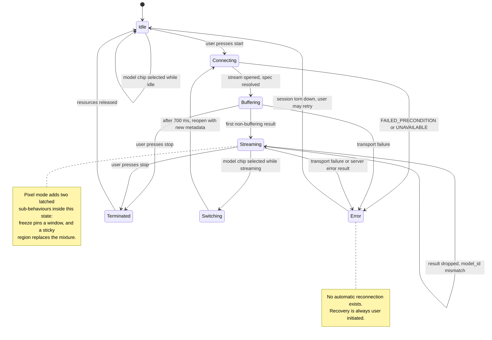

Note the absence of a reconnecting state. It is not an omission from the
diagram; the implementation has none.

---

## 15. Attribution and licensing

### 15.1 The central statement

**Neither model in this system was trained by this team.** Both are pretrained
checkpoints published as artefacts of prior research, used unmodified. No
training run was performed, no dataset was collected, and no fine-tuning was
carried out. The project's contribution is the system around them: the live
streaming architecture, the windowing and reconstruction, the multi-model
registry, the mobile client, and the region-query mode built on the linear
structure of one of the two synthesizers.

### 15.2 Third-party components and their provenance

| Component | Origin | Licence as recorded in this working tree |
|---|---|---|
| Multisensory research code (`multisensory/src`, `aolib`) | Owens and Efros, published implementation | **Apache License 2.0**, copyright 2018 Andrew Owens and Alexei A. Efros, file present |
| Multisensory checkpoints (`net.tf-160000`, and the shift, CAM, large and unet-pit variants) | Downloaded from the authors' distribution, by the script in the repository | Covered by the same licence file |
| Sound of Pixels network definitions and helpers (`src/models`, the frequency warp helper, the video transform helpers) | Derived from the published reference implementation | **No licence file and no upstream reference are recorded in this repository.** This is a gap; see below. |
| Sound of Pixels checkpoints (`sound_best.pth`, `frame_best.pth`, `synthesizer_best.pth`) | Pretrained weights, provenance not recorded in this working tree | not recorded |
| PyTorch, torchvision | Meta and contributors | BSD-style, per upstream |
| TensorFlow | Google and contributors | Apache 2.0, per upstream |
| gRPC, Protocol Buffers | Google and contributors | Apache 2.0 / BSD, per upstream |
| FastAPI, uvicorn, NumPy, SciPy, librosa, soundfile, OpenCV, Pillow, MoviePy | respective projects | per upstream |
| CameraX, AndroidX, Material Components, Media3 | Google | Apache 2.0, per upstream |
| Zoomage | third party | per upstream |
| The magma colour map | derived from the matplotlib perceptual colour maps | per upstream |

**The attribution gap is real and should be closed before submission.** The
backend's model definitions are recognisably the Sound of Pixels reference
implementation — the builder, the U-Net block structure, the dilated ResNet
wrapper, the inner-product synthesizer, the log-frequency warp grid and the
video transform utilities — and this repository records neither the upstream
project nor its licence. Both the backend and mobile repositories carry a
placeholder licence line reading "Distribute your license here."

### 15.3 Datasets behind the checkpoints, and what they imply

| Checkpoint | Trained on | What that implies about where the system works |
|---|---|---|
| Sound of Pixels: sound, frame, synthesizer | **MUSIC** — untrimmed video of musical solos and duets across eleven instrument categories, collected from a video-sharing site, with self-supervision by artificial mixtures | Strongest where the sound source is a visibly played instrument in reasonable light, filling a meaningful part of the frame. Weak or meaningless on speech, on loudspeakers, on off-screen sound, and on instrument classes outside the eleven. |
| Multisensory: features | **AudioSet** — a large collection of unlabelled video, used for the temporal-alignment pretext task | The alignment features are the most broadly trained component in the system, which is why its *localization* generalises further than its separation. |
| Multisensory: separation head | **VoxCeleb** — speech video | Strongest on a visible person speaking. Separation quality on music is unverified. |

The practical consequence for a user is exactly the choice the interface
presents: point at instruments and choose the music mode, point at a person
talking and choose the speech mode. It is not a preference. It is which
distribution the weights came from.

---

## 16. Conclusion

SonicSight takes two published audio-visual separation models and makes them
usable live, from a phone, on a scene the user chooses by pointing at it. The
engineering that this required is mostly not model work. It is windowing a
signal with no end, reconstructing a continuous waveform from independently
estimated overlapping windows without audible seams, correcting the geometric
and spectral mismatch between a consumer handset and what the networks were
trained on, and holding all of it inside a latency budget dominated by a term
that no optimisation can reduce.

Three results are worth restating. The first is architectural: because one of
the two synthesizers is a linear function of a visual feature vector, an
arbitrary spatial region's audio costs one matrix product against tensors that
have already been computed. That single property is what turns "separate the
left half from the right half" into "hear anywhere you touch" without a second
model, a second checkpoint, or a second forward pass. The second is
methodological: the localization cross-check was designed so that a wrongly
wired model would fail it, and the same experiment run at a plausible but wrong
window length *did* fail it — which is the clearest available demonstration
that a test which cannot fail proves nothing, and that a parameter which
produces confident wrong output is more dangerous than one which crashes. The
third is about honesty in a system's own interface: the speech model can assert
that nothing on screen explains what it is hearing, and the application renders
that assertion as an explicit state rather than as a plausible-looking overlay.

The system's weakest point is not any of its parts but the evidence covering
the joins between them. The models are well measured. The registry, the
adapters, the switch, the touch mode and the mobile client are, in the terms
this report has used throughout, implemented and not validated. The written
gates exist and are specific; running them, and measuring video memory with
both models resident, is the work that would move the largest number of rows in
Table 1 from one label to another.

---

## References

[1] H. Zhao, C. Gan, A. Rouditchenko, C. Vondrick, J. McDermott and A.
Torralba, "The Sound of Pixels," in *Proceedings of the European Conference on
Computer Vision (ECCV)*, Munich, Germany, September 2018. Preprint:
arXiv:1804.03160v4 [cs.CV], submitted 9 April 2018, last revised 14 October
2018.

[2] A. Owens and A. A. Efros, "Audio-Visual Scene Analysis with Self-Supervised
Multisensory Features," in *Proceedings of the European Conference on Computer
Vision (ECCV)*, Munich, Germany, September 2018. Preprint: arXiv:1804.03641v2
[cs.CV], submitted 10 April 2018, revised 9 October 2018. Project page:
`http://andrewowens.com/multisensory`. Source and checkpoints distributed under
the Apache License 2.0.

[3] J. F. Gemmeke, D. P. W. Ellis, D. Freedman, A. Jansen, W. Lawrence, R. C.
Moore, M. Plakal and M. Ritter, "Audio Set: An ontology and human-labeled
dataset for audio events," in *IEEE International Conference on Acoustics,
Speech and Signal Processing (ICASSP)*, New Orleans, USA, 2017. The pretraining
corpus for [2].

[4] A. Nagrani, J. S. Chung and A. Zisserman, "VoxCeleb: A large-scale speaker
identification dataset," in *Proceedings of Interspeech*, Stockholm, Sweden,
2017. The fine-tuning corpus for the separation head of [2].

[5] O. Ronneberger, P. Fischer and T. Brox, "U-Net: Convolutional Networks for
Biomedical Image Segmentation," in *Medical Image Computing and
Computer-Assisted Intervention (MICCAI)*, Munich, Germany, 2015. The
encoder-decoder architecture used as the audio analysis network in [1].

[6] K. He, X. Zhang, S. Ren and J. Sun, "Deep Residual Learning for Image
Recognition," in *IEEE Conference on Computer Vision and Pattern Recognition
(CVPR)*, Las Vegas, USA, 2016. The backbone of the video analysis network in
[1].

[7] E. Vincent, R. Gribonval and C. Févotte, "Performance measurement in blind
audio source separation," *IEEE Transactions on Audio, Speech, and Language
Processing*, vol. 14, no. 4, pp. 1462–1469, 2006. Defines the
signal-to-distortion, signal-to-interference and signal-to-artefacts ratios
referred to in Section 2.2.

**A note on the numeric claims attributed to [1] and [2].** The author lists,
venues, preprint identifiers and versions above were verified against the
arXiv records while preparing this report. The quantitative results quoted in
Section 11.2 — human-evaluation percentages, per-channel category accuracies,
alignment accuracy, and the separation decibel figures — were transcribed from
this project's own reference notes and were **not** re-verified against the
papers. The same applies to two descriptive claims: the number of instrument
categories in the MUSIC dataset given in Sections 2.3, 11.1 and 15.3, and the
scale of the AudioSet pretraining corpus given in Section 2.4. All of these are
presented as recorded, not as checked. Every number attributed to *this
system* rather than to a paper was taken from the code or from the project's
own measurement records, as traced in Appendix A.

---

## Appendix A — Traceability

Every architectural claim in the body maps to a location in the working trees
documented on page one. Paths are relative to each repository's root.
Line numbers are valid for the commits named in the front matter.

### A.1 Transport and protocol

| Claim (section) | Location |
|---|---|
| gRPC server binds an insecure port; no transport security (3.3, 12.1) | `SonicSightBackend/src/grpc_server.py:973` |
| gzip compression at level 1 on the channel (6.1) | `SonicSightBackend/src/grpc_server.py:966-967` |
| 16 MB message limits both directions (6.1) | `SonicSightBackend/src/grpc_server.py:962-963` |
| Client opts into plaintext; keep-alive 30 s / 10 s (5.5, 12.1) | `SonicSightMobile/.../data/api/GrpcModule.kt:50-56` |
| Manifest permits cleartext traffic (12.1) | `SonicSightMobile/app/src/main/AndroidManifest.xml:19` |
| Model selection metadata key and default (4.4, 6.5) | `SonicSightBackend/src/model_registry.py:21-25`; read at `grpc_server.py:54-55` |
| Unknown model rejected with FAILED_PRECONDITION (6.5) | `SonicSightBackend/src/grpc_server.py:57-61` |
| Known but unloaded model rejected (6.5) | `SonicSightBackend/src/grpc_server.py:63-67` |
| Client attaches the metadata via a header interceptor (5.5) | `SonicSightMobile/.../data/repository/GrpcVideoRepository.kt:49-60` |
| Upload chunk ordering enforced with OUT_OF_RANGE (4.2, 6.5) | `SonicSightBackend/src/grpc_server.py:855-856` |
| Upload requires metadata on the first chunk (4.2, 6.5) | `SonicSightBackend/src/grpc_server.py:867-871` |
| Upload inactivity 30 s and total 120 s timeouts (4.2) | `SonicSightBackend/src/grpc_server.py:842, 865` |
| HealthCheck implementation (4.7) | `SonicSightBackend/src/grpc_server.py:40-47` |
| Client never calls HealthCheck (4.7, Figure 6) | absence: no match for `healthCheck` under `SonicSightMobile/app/src/main/java` |
| The two protocol copies are byte-identical (6.1, 14.3) | `SonicSightBackend/sonicsight.proto` and `SonicSightMobile/app/src/main/proto/sonicsight.proto`, SHA-256 `93B97DA2…F09AD5BD` |

### A.2 Registry and engines

| Claim (section) | Location |
|---|---|
| Frozen specification dataclass and all fields (4.3, Table 6) | `SonicSightBackend/src/model_registry.py:28-77` |
| `sonicsight` entry | `SonicSightBackend/src/model_registry.py:92-117` |
| `multisensory` entry, including hop rationale | `SonicSightBackend/src/model_registry.py:120-153` |
| `sonicsight-pixel` entry, same engine factory | `SonicSightBackend/src/model_registry.py:156-182` |
| Registry dictionary and engine cache (4.3) | `SonicSightBackend/src/model_registry.py:185-199` |
| Load-all tolerates per-model failure (4.7) | `SonicSightBackend/src/model_registry.py:202-212` |
| Loaded-model reporting (4.7) | `SonicSightBackend/src/model_registry.py:215-224` |
| Engine adapter contract (4.3) | `SonicSightBackend/src/engines/__init__.py:24-41` |
| Sound of Pixels adapter delegates to the singleton (4.3) | `SonicSightBackend/src/engines/sonicsight_engine.py:12-46` |
| Multisensory adapter defers the TensorFlow import into `load` (4.3, 4.7) | `SonicSightBackend/src/engines/multisensory_engine.py:180-181` |
| Adapter asserts the locked window and map flag at load (4.7, 8.2) | `SonicSightBackend/src/engines/multisensory_engine.py:184-192` |
| Client-side mirror of the specification (5.1) | `SonicSightMobile/.../data/model/ModelProfile.kt:51-96` |

### A.3 Buffering, windowing and reconstruction

| Claim (section) | Location |
|---|---|
| Streaming buffer constructed from the specification (4.4) | `SonicSightBackend/src/grpc_server.py:83-91`; definition `inference.py:55-64` |
| Audio ring capped at 15 s (4.4, 9.4) | `SonicSightBackend/src/inference.py:127` |
| Frame ring capped per model (4.4, 9.4) | `SonicSightBackend/src/inference.py:180-181` |
| Frame-selection dispatch, three rules (4.4, 7.2) | `SonicSightBackend/src/inference.py:201-237` |
| Window start floored to the STFT hop (4.4, 7.2) | `SonicSightBackend/src/inference.py:357, 364` |
| Minimum timeline advance between windows (4.3, 4.4) | `SonicSightBackend/src/inference.py:371-391` |
| Early-inference mode (4.4) | `SonicSightBackend/src/inference.py:260-317` |
| Early windows excluded from overlap-add, with rationale (4.4) | `SonicSightBackend/src/grpc_server.py:240-260` |
| Oversized-drain cap uses the module constant, not the spec (4.4, 11.4 item 3) | `SonicSightBackend/src/grpc_server.py:273` versus `grpc_server.py:504` |
| Unreachable centre-offset computation (11.4 item 4) | `SonicSightBackend/src/grpc_server.py:230-238` |
| Overlap-add timeline contract (4.4, 7.4) | `SonicSightBackend/src/overlap_add_buffer.py:6-27, 77-124` |
| Centre-start and crossfade construction (7.4) | `SonicSightBackend/src/overlap_add_buffer.py:29-57` |
| Buffering keep-alive every tenth chunk (4.4) | `SonicSightBackend/src/grpc_server.py:166` |

### A.4 Inference, Sound of Pixels

| Claim (section) | Location |
|---|---|
| Checkpoint paths and existence check (4.7) | `SonicSightBackend/src/inference.py:450-458` |
| Mixed precision disabled on GTX 16-series (4.7) | `SonicSightBackend/src/inference.py:447` |
| Warp grids precomputed (7.3) | `SonicSightBackend/src/inference.py:482-487` |
| Warm-up pass at load (4.7) | `SonicSightBackend/src/inference.py:517-528` |
| Input level normalisation and its smoothing (7.3) | `SonicSightBackend/src/inference.py:530-569` |
| STFT parameters and the 512 × 256 slice (7.3) | `SonicSightBackend/src/inference.py:629-646` |
| Streaming inference entry point (7.3) | `SonicSightBackend/src/inference.py:1008` |
| Garbage collector disabled in the latency path (4.5) | `SonicSightBackend/src/inference.py:1013-1019` |
| Log-frequency warp before the sound network (7.3) | `SonicSightBackend/src/inference.py:1055-1060` |
| Frame features without pooling (7.3) | `SonicSightBackend/src/inference.py:1063-1065` |
| Deployed video-level pooling branch (7.3, 11.1) | `SonicSightBackend/src/inference.py:1138-1154` |
| Alternative pixel-level conditioning, env-gated (7.3, 11.1) | `SonicSightBackend/src/inference.py:1076-1137` |
| Inverse warp of the mask (7.4) | `SonicSightBackend/src/inference.py:1157-1162` |
| Mask moving average, inactive by default (Table 7) | `SonicSightBackend/src/inference.py:1184-1193` |
| Mask renormalisation (7.4) | `SonicSightBackend/src/inference.py:1195-1199` |
| Polar reconstruction and inverse STFT (7.4) | `SonicSightBackend/src/inference.py:1214-1226` |
| Localization branch forced to single precision (7.3) | `SonicSightBackend/src/inference.py:1237-1264` |
| Map interpolated to 56 × 56 (6.2, 7.3) | `SonicSightBackend/src/inference.py:1278-1283` |
| Map quantised to unsigned bytes on the wire (6.2) | `SonicSightBackend/src/grpc_server.py:364-365` |
| Centre frame deliberately left empty (6.4) | `SonicSightBackend/src/grpc_server.py:366` |
| Feature channels = 32 (2.3, 8.2) | `SonicSightBackend/src/config.py:7` |
| Feature grid 14 × 14 from stride-16 dilation (2.3, 11.2) | `SonicSightBackend/src/models/vision_net.py:69, 79-80` |
| Linear synthesizer, 33 parameters (2.3, 8.4) | `SonicSightBackend/src/models/synthesizer_net.py:6-38` |
| Pixelwise evaluation of the synthesizer (2.3, 7.3) | `SonicSightBackend/src/models/synthesizer_net.py:30-38` |

### A.5 Touch mode

| Claim (section) | Location |
|---|---|
| Dedicated stream loop (4.4, 7.6) | `SonicSightBackend/src/grpc_server.py:456-816` |
| Mode dispatch on the specification (4.4) | `SonicSightBackend/src/grpc_server.py:72-77` |
| Feature pass with a private gain average (7.6, 8.4) | `SonicSightBackend/src/inference.py:1336-1420`, private average at `:1374-1381` |
| Cached tensors and their shapes (7.6, 9.4) | `SonicSightBackend/src/pixel_cache.py:54-82` |
| Cache ring of three with pinning (7.6) | `SonicSightBackend/src/pixel_cache.py:85-138`; constructed at `grpc_server.py:493` |
| Region weights from a tap (7.6) | `SonicSightBackend/src/pixel_cache.py:141-160` |
| Region synthesis, pooling and deployed post-processing order (7.6, 8.4) | `SonicSightBackend/src/pixel_cache.py:172-249` |
| Region pooling is a maximum over support (8.4) | `SonicSightBackend/src/pixel_cache.py:45, 163-169` |
| Per-cell analysis, chunked by 28 (7.6) | `SonicSightBackend/src/pixel_cache.py:252-301` |
| Energy-map contrast normalisation and peak hold (7.6) | `SonicSightBackend/src/pixel_cache.py:310-348` |
| Query cap, tap tail length, freeze and cluster latches (6.2, 6.4) | `SonicSightBackend/src/grpc_server.py:496-526` |
| Query answers carry sequence number zero (6.2) | `SonicSightBackend/src/grpc_server.py:649-663` |
| Honest-silence gate on a query (7.6) | `SonicSightBackend/src/grpc_server.py:609-618` |
| Sticky region replaces the mixture (4.4, 6.2) | `SonicSightBackend/src/grpc_server.py:583-585, 706-716` |
| Energy map and grid dimensions on the wire (6.2) | `SonicSightBackend/src/grpc_server.py:748-766` |
| Silence gate, clustering, persistence and colours (7.6) | `SonicSightBackend/src/clustering.py:31-74, 153-287` |

### A.6 Multisensory integration

| Claim (section) | Location |
|---|---|
| Locked window, rates, frame count, confidence threshold (8.2, 8.3) | `SonicSightBackend/src/engines/multisensory_engine.py:37-56` |
| Map reduction reproduces the validated tooling (8.3) | `SonicSightBackend/src/engines/multisensory_engine.py:68-108` |
| Wire-rate to model-rate resampling, 20:21 (7.7, 8.5) | `SonicSightBackend/src/engines/multisensory_engine.py:124-131` |
| Graph construction, CAM presence check (4.7, 8.5) | `SonicSightBackend/src/engines/multisensory_engine.py:156-213` |
| Confidence gate withholds the map (8.3) | `SonicSightBackend/src/engines/multisensory_engine.py:247-259` |
| Separation and map from one session run (8.5) | `multisensory/src/sep_video.py:168-218` |
| CAM tap taken before the graph is finalized (8.5) | `multisensory/src/sep_video.py:111-124` |
| cuDNN workspace cap set at module level (Table 7, 9.3) | `multisensory/src/sep_video.py:14-27` |
| Session configuration from environment (Table 7) | `multisensory/src/sep_video.py:30-57` |
| Locked window and derived spectrogram length (8.2) | `multisensory/src/sep_params.py:8, 114-115` |
| Multisensory STFT frame and hop derivation (7.7) | `multisensory/src/soundrep.py:82-84` |
| Input level in the parameters (8.5) | `multisensory/src/sep_params.py:112` |

### A.7 Mobile

| Claim (section) | Location |
|---|---|
| CameraX analysis configuration and throttle (5.2) | `SonicSightMobile/.../presentation/ui/MainActivity.kt:852-870` |
| Image transform chain (5.2, 7.1) | `MainActivity.kt:888-940`; `util/ImageTransform.kt:46-142` |
| Halves scale and crop arithmetic (5.2, 11.3) | `util/ImageTransform.kt:46-83` |
| Letterbox geometry (5.2) | `util/ImageTransform.kt:124-142` |
| Audio capture block sizing (5.3) | `MainActivity.kt:973-984` |
| Audio source preference order (5.3) | `MainActivity.kt:989-1017` |
| Anti-aliasing decimator (5.3) | `util/AudioDecimator.kt:24-113` |
| Unconditional microphone dumping (11.4 item 1, 12.3) | `MainActivity.kt:1037-1063`; `util/RawAudioDumper.kt` |
| Frames droppable, audio lossless (5.4) | `presentation/viewmodel/MainViewModel.kt:250-265` |
| Fresh outbound flow per stream (5.4) | `MainViewModel.kt:222-224` |
| Stale-result filter on the echoed model id (3.4, 5.5) | `MainViewModel.kt:267-278` |
| Sequence-gap silence insertion (7.4) | `MainViewModel.kt:304-316` |
| Touch-mode result handling (7.6) | `MainViewModel.kt:326-363` |
| Model switch protocol, 700 ms delay (3.4, Figure 8) | `MainActivity.kt:191-202` |
| Playback construction from the profile (5.6) | `MainActivity.kt:506-590` |
| Jitter buffer sizing and adaptation (5.6, 9.4) | `util/JitterBuffer.kt:26-68, 168-255` |
| Overlay decode, palette and alpha curve (5.6) | `util/MaskProcessor.kt:100-147` |
| Touch-mode overlay at explicit dimensions (5.6) | `util/MaskProcessor.kt:160-197` |
| Coordinate chain (5.6) | `util/CoordinateMap.kt:27-83` |
| Overlay and lattice registration matrix (5.6) | `MainActivity.kt:215-250` |
| Touch gesture handling (5.6) | `MainActivity.kt:262-332` |
| Only `onDestroy` releases resources (11.4 item 2, 12.3) | `MainActivity.kt:1173-1179` |
| Orientation locked to sensor-landscape (11.3) | `AndroidManifest.xml:23` |
| Backup enabled with template rules (12.3) | `AndroidManifest.xml:11-13`; `res/xml/backup_rules.xml`; `res/xml/data_extraction_rules.xml` |

### A.8 Validation and evidence

| Claim (section) | Location |
|---|---|
| Migration harness stages T0 to T5 (10.2) | `multisensory/t0_smoke.sh`, `t1_py3_audit.py`, `t2_pretext_oracle.py`, `t3_dump_activations.py`, `t4_compare_dumps.py`, `Dockerfile.tf18`, described in `multisensory/README.md` |
| No harness result artefacts present (10.2) | absence: no `t0_smoke.log`, no `dump_tf18.npz`, no `dump_py313.npz` in `multisensory/` |
| Localization cross-check method and result (10.3) | `HANDOFF (2).md` §4; tooling `multisensory/src/sep_cam_probe.py`, `src/cam_analyze.py` |
| CPU versus GPU equivalence (10.4) | `HANDOFF (2).md` §5.5 |
| Latency and video-memory measurements (9.3) | `HANDOFF (2).md` §5.1–5.2; workspace table reproduced in `multisensory/src/sep_video.py:14-27` |
| Integration test plan T1 to T8, unrun (10.1, 10.6) | `SonicSightBackend/TESTPLAN.md` |
| Deterministic replay harness and its rationale (14.2) | `SonicSightBackend/replay_client.py:1-52` |
| Offline touch-mode comparison harness (13.2) | `SonicSightBackend/pixel_ab_harness.py:1-25` |
| Streaming diagnostic recorder (4.4, 12.3) | `SonicSightBackend/src/stream_dump.py` |
| Unit suite result (10.5) | executed 2026-08-05; see Section 10.5 for conditions |
| Manual script collected as tests (10.5, 11.4 item 6) | `SonicSightBackend/tests/test_grpc_client.py:13, 23` |

---

## Appendix B — Complete protocol source

Reproduced verbatim from `SonicSightBackend/sonicsight.proto` at commit
`9da8709`. The copy at `SonicSightMobile/app/src/main/proto/sonicsight.proto`
is byte-identical (SHA-256 `93B97DA2EB379804636E2F22B03D950E7BC01D7AAD613CDA3D29CAB9F09AD5BD`).

Where a comment below disagrees with the implementation, Section 6.4 records
the divergence and this report follows the code.

```protobuf
syntax = "proto3";

package sonicsight;

option java_package = "com.k1llerwhale.sonicsight.grpc";
option java_multiple_files = true;

// ──────────────────────────────────────────────
// Core Service
// ──────────────────────────────────────────────
service SonicSightService {
  // Client streams raw video chunks → server returns inference results
  rpc ProcessVideo (stream VideoChunk) returns (InferenceResult);

  // Bidirectional streaming for near real-time processing
  // Client streams continuous raw frames + audio
  // Server streams back continuous separated audio + heatmaps
  rpc StreamProcess (stream StreamChunk) returns (stream StreamResult);

  // Health check
  rpc HealthCheck (Empty) returns (HealthResponse);
}

// ──────────────────────────────────────────────
// Messages
// ──────────────────────────────────────────────
message Empty {}

message HealthResponse {
  bool model_loaded = 1;
  string device = 2;

  // Model ids whose checkpoints actually loaded (e.g. "sonicsight",
  // "multisensory"). Empty on older servers that predate this field.
  repeated string loaded_models = 3;
}

// Sent by mobile client as a stream
message VideoChunk {
  // Chunk metadata (only required in first chunk)
  VideoMetadata metadata = 1;

  // Raw video bytes (chunk of the raw MP4 file)
  bytes data = 2;

  // Chunk sequence number (0-indexed)
  int32 chunk_index = 3;

  // True for the final chunk
  bool is_last = 4;
}

message VideoMetadata {
  // Total expected file size in bytes (for validation)
  int64 total_size = 1;

  // Original filename
  string filename = 2;

  // MIME type
  string mime_type = 3;

  // Video duration in milliseconds
  int64 duration_ms = 4;
}

// Returned by server after complete inference
message InferenceResult {
  // Processing status
  bool success = 1;
  string error_message = 2;

  // Separated audio (raw PCM bytes, 16-bit signed, 11025Hz, mono)
  bytes left_audio_pcm = 3;
  bytes right_audio_pcm = 4;

  // Audio metadata
  int32 audio_sample_rate = 5;  // Always 11025

  // Heatmap masks as raw float32 arrays (little-endian)
  // Shape: [224 x 224] = 50176 values = 200704 bytes per side
  bytes left_heatmap = 6;
  bytes right_heatmap = 7;

  // Center frames for overlay (JPEG-encoded)
  bytes left_center_frame = 8;
  bytes right_center_frame = 9;

  // Processing time in milliseconds
  int64 processing_time_ms = 10;
}

// A spatial query in pixel mode (model id "sonicsight-pixel"). Coordinates
// are normalized to the letterboxed 224x224 frame space — the one space both
// client and server can compute exactly.
message PixelQuery {
  int32 query_id    = 1;  // client-assigned, echoed back in PixelAudio
  float x_norm      = 2;  // 0..1
  float y_norm      = 3;  // 0..1
  float radius_norm = 4;  // 0 = single feature cell; >0 = pooled neighbourhood
  int64 window_id   = 5;  // 0 = newest cached window; else a pinned window's id

  // Sticky follow: instead of a one-shot PixelAudio answer, this region
  // becomes the stream's followed selection — every subsequent window's
  // left_audio_pcm carries the REGION's audio (OLA-stitched, live, ~3 s
  // perceived latency) in place of the mixture, until StreamChunk.clear_sticky
  // or a new sticky query replaces it. Sticky queries get no PixelAudio.
  bool sticky = 6;
}

message PixelAudio {
  int32 query_id     = 1;
  bytes pcm          = 2;  // PCM16 mono 11025 Hz, one analysis window long
  int32 sample_count = 3;
  float energy       = 4;  // RELATIVE: fraction of the window's mixture energy
                           // in the region, 0..1 — scale-free so the client's
                           // "nothing here" gate is meaningful
  int64 window_id    = 5;  // window this audio was synthesized from
  string error       = 6;  // non-empty: requested window evicted, or query cap hit
}

message SourceCluster {
  int32  cluster_id = 1;
  float  centroid_x = 2;  // normalized, letterboxed frame space
  float  centroid_y = 3;
  float  energy     = 4;
  uint32 rgb        = 5;  // stable colour, carried across windows by the server
}

// Sent by mobile client continuously as a stream
message StreamChunk {
  // Timestamp in milliseconds (relative to start of recording)
  // Used for syncing audio and video
  int64 timestamp_ms = 1;

  // Raw JPEG-encoded video frames (spatially cropped 224x224)
  // Optional: A chunk might contain only audio
  // Used by the "sonicsight" (Sound of Pixels) model branch.
  bytes left_jpeg = 2;
  bytes right_jpeg = 7;

  // Frame width and height (required if jpeg frames are present, usually 224)
  int32 frame_width = 3;
  int32 frame_height = 4;

  // Raw PCM audio chunk (16-bit signed, mono, 11025 Hz)
  // Required on the "sonicsight" model branch.
  bytes audio_pcm = 5;

  // True for the final chunk in the stream
  bool is_last = 6;

  // Full camera frame, letterboxed to 224x224 (1280x720 -> 224x126 content
  // with 49 grey rows top and bottom), JPEG-encoded.
  // Used by the "multisensory" model branch instead of left_jpeg/right_jpeg.
  bytes full_jpeg = 8;

  // Raw PCM audio chunk (16-bit signed, mono, 22050 Hz).
  // Used by the "multisensory" model branch instead of audio_pcm.
  bytes audio_pcm_hi = 9;

  // ── Pixel mode ("sonicsight-pixel") ──
  // In-band spatial queries against the server's cached window state.
  // Queries ride the stream because the stream owns the cache; capped at 4
  // per chunk — excess queries are answered with an error PixelAudio.
  repeated PixelQuery queries = 10;

  // Source discovery enable. Set true on any chunk at least once per second
  // while the cluster UI is active; the server latches it for ~1 s past the
  // last request (audio and frame chunks come from different client threads,
  // so a strict per-chunk level would flap). Letting it expire is the off
  // switch and resets cluster identity state server-side.
  bool request_clusters = 11;

  // Release the sticky followed region: the live stream returns to the
  // unseparated mixture from the next window on.
  bool clear_sticky = 13;

  // Freeze is LEVEL-triggered: hold true on every chunk while the user is
  // exploring a frozen scene, false to release. On the rising edge the
  // server pins its newest completed window (exempt from cache eviction;
  // windows keep advancing normally), and WHILE FROZEN a PixelQuery with
  // window_id = 0 resolves to the pinned window — the client never needs to
  // learn the server's window id to query the frozen scene. Query results
  // carry sequence_number = 0 so they stay outside audio gap detection.
  bool freeze = 12;
}

// Returned by server continuously as a stream
message StreamResult {
  // Processing status
  bool success = 1;
  string error_message = 2;

  // Timestamp of the center frame this result corresponds to
  int64 timestamp_ms = 3;

  // Separated audio chunk corresponding to this timestep (raw PCM bytes,
  // 16-bit signed, mono). Sample rate depends on the model: 11025 Hz on the
  // "sonicsight" branch, 21000 Hz on the "multisensory" branch. The client
  // configures playback from its model profile.
  // This will be a small chunk (e.g., 0.1s to 0.5s of audio) to be played immediately
  bytes left_audio_pcm = 4;
  bytes right_audio_pcm = 5;

  // Heatmap masks as uint8 arrays (0-255), square grid.
  // Currently 56 x 56 = 3136 bytes per side. The client infers the grid side
  // from sqrt(byte count), so any square size decodes.
  // When heatmap_count == 1 (multisensory), only left_heatmap is populated
  // and right_heatmap is empty.
  bytes left_heatmap = 6;
  bytes right_heatmap = 7;

  // The center frame for overlay (JPEG-encoded)
  // Sent back so the client doesn't need to buffer frames locally for overlaying
  bytes center_frame_jpeg = 8;

  // Indicates if this is just a buffering acknowledgment (no results yet)
  bool is_buffering = 9;

  // Performance metrics (optional)
  int64 inference_time_ms = 10;
  int64 post_processing_time_ms = 11;
  int64 total_server_time_ms = 12;

  // Monotonically increasing sequence number for gap detection.
  // Allows the client to detect missed/dropped results and insert
  // compensating silence into the jitter buffer.
  int32 sequence_number = 13;

  // Number of PCM16 samples in each audio channel (left/right).
  // Allows the client to know exactly how much audio time this result covers.
  int32 audio_sample_count = 14;

  // Echoes the model id this result was produced by ("sonicsight" |
  // "multisensory"). The client drops results whose model_id does not match
  // its current selection, discarding in-flight results after a model switch.
  string model_id = 15;

  // Number of heatmaps in this result: 2 = left/right (Sound of Pixels),
  // 1 = single full-frame map in left_heatmap only (multisensory CAM).
  int32 heatmap_count = 16;

  // Raw-CAM positive fraction in [0, 1] for confidence-gated models
  // (multisensory). The alignment head the CAM comes from is never touched
  // by the separation loss; below 0.10 the map means "this audio does not
  // match this video" and the server sends left_heatmap empty. The client
  // shows an honest "no confident localization" state instead of a garbage
  // overlay; separated audio still plays. Always 0.0 for models without a
  // confidence gate (sonicsight).
  float cam_confidence = 17;

  // ── Pixel mode ("sonicsight-pixel") ──
  // In pixel mode the legacy fields are repurposed DELIBERATELY:
  // left_audio_pcm carries the UNSEPARATED MIXTURE (the mixer baseline the
  // client needs for mix/solo), right_audio_pcm is empty, and
  // left_heatmap/right_heatmap are empty — the native-resolution energy map
  // below is the only spatial payload, so a result never carries two
  // heatmap-shaped payloads with different semantics.
  repeated PixelAudio pixel_audio = 18;

  // Per-cell sound energy at the model's NATIVE feature grid (currently
  // 14x14 for a 224x224 input), row-major uint8, EMA-smoothed across
  // windows. Dimensions are explicit — the client interpolates; the server
  // never resamples up to fake resolution the model does not have.
  bytes energy_map = 19;
  int32 grid_width = 20;
  int32 grid_height = 21;

  // Source discovery: cluster label per cell (uint8, row-major, 255 =
  // silence) plus one SourceCluster per discovered source. Labels and
  // colours are matched across windows server-side so they do not strobe.
  bytes cluster_labels = 22;
  repeated SourceCluster clusters = 23;

  // Which cached window the energy map, clusters and mixture in this result
  // describe (matches PixelQuery/PixelAudio window_id).
  int64 window_id = 24;
}
```

---

## Appendix C — Configuration reference

Every constant and environment variable that changes behaviour. **Locked**
means the value is bound to a checkpoint or to a validated measurement and must
not be treated as a tunable.

### C.1 Sound of Pixels model constants

Source: `SonicSightBackend/src/config.py`.

| Name | Value | Line | Locked | Notes |
|---|---|---|---|---|
| `ARCH_SOUND` | `unet7` | 4 | yes | U-Net with seven downsamplings |
| `ARCH_FRAME` | `resnet18dilated` | 5 | yes | |
| `ARCH_SYNTH` | `linear` | 6 | yes | Inner product |
| `NUM_CHANNELS` | 32 | 7 | yes | Feature channels; overrides the builder default of 64 |
| `NUM_MIX` | 2 | 8 | — | Imported and never used |
| `NUM_FRAMES` | 3 | 9 | yes | Frames per window |
| `STRIDE_FRAMES` | 24 | 10 | — | Offline file path only, not the streaming path |
| `FRAME_RATE` | 8 | 11 | yes | Sets the hop |
| `IMG_SIZE` | 224 | 12 | yes | |
| `AUD_LEN` | 65536 | 13 | yes | Analysis window |
| `AUD_RATE` | 11025 | 14 | yes | |
| `STFT_FRAME` | 1022 | 15 | yes | Gives 512 frequency bins |
| `STFT_HOP` | 256 | 16 | yes | Also the window-start alignment quantum |
| `LOG_FREQ` | 1 | 17 | yes | Log-frequency warp enabled |
| `MASK_THRES` | 0.5 | 21 | — | Only used when binary masking is on |
| `MASK_RENORM_EPS` | 1e-8 | 57 | — | Guards division by zero; explicitly "not a tunable" |
| `IMG_POOL` | `maxpool` | 117 | yes | Matches the checkpoint's training-time pooling |
| `CKPT_ROOT` | `src/ckpt` | 118 | — | |

### C.2 Environment variables

Full effects are in Table 7; this is the index.

| Variable | Default | Defined at |
|---|---|---|
| `SONICSIGHT_BINARY_MASK` | 0 | `config.py:20` |
| `SONICSIGHT_MASK_RENORM` | 1 | `config.py:29` |
| `SONICSIGHT_MASK_RENORM_FLOOR` | 0.0 | `config.py:54` |
| `SONICSIGHT_SEPARATION_MODE` | `video` | `config.py:64` |
| `SONICSIGHT_SEP_TOPK` | 4 | `config.py:69` |
| `SONICSIGHT_MASK_SMOOTH` | 1.0 | `config.py:76` |
| `SONICSIGHT_AUDIO_NORM` | 1 | `config.py:87` |
| `SONICSIGHT_AUDIO_NORM_TARGET_RMS` | 0.10 | `config.py:88-90` |
| `SONICSIGHT_AUDIO_NORM_MAX_GAIN` | 20.0 | `config.py:93` |
| `SONICSIGHT_AUDIO_NORM_MIN_RMS` | 1e-4 | `config.py:96` |
| `SONICSIGHT_AUDIO_NORM_SMOOTH` | 0.3 | `config.py:103` |
| `SONICSIGHT_DUMP_STREAM` | 0 | `config.py:111` |
| `SONICSIGHT_DUMP_DIR` | `src/outputs/streamdump` | `config.py:112-115` |
| `MULTISENSORY_ROOT` | sibling checkout | `engines/multisensory_engine.py:160` |
| `MULTISENSORY_CHECKPOINT` | `<root>/results/nets/sep/full/net.tf-160000` | `engines/multisensory_engine.py:166-168` |
| `MS_GPU` | `0` | `engines/multisensory_engine.py:197` |
| `MULTISENSORY_RESULTS` | `../results` | `multisensory/src/sep_params.py:18` |
| `MS_GPU_ALLOW_GROWTH` | `1` | `multisensory/src/sep_video.py:47` |
| `MS_GPU_MEM_FRACTION` | unset | `multisensory/src/sep_video.py:49` |
| `MS_GPU_LOG` | unset | `multisensory/src/sep_video.py:52` |
| `TF_CUDNN_WORKSPACE_LIMIT_IN_MB` | 512 | `multisensory/src/sep_video.py:27` |

### C.3 Multisensory engine constants

Source: `SonicSightBackend/src/engines/multisensory_engine.py`.

| Name | Value | Line | Locked | Notes |
|---|---|---|---|---|
| `VID_DUR` | 2.135 s | 37 | **yes** | Section 8.2 |
| `MODEL_SR` | 21000 | 39 | yes | |
| `WIRE_SR` | 22050 | 40 | yes | Exact 21:20 ratio to the model rate |
| `NUM_SAMPLES` | 44144 | 41 | yes | Window at the model rate |
| `NUM_FRAMES` | 63 | 42 | yes | |
| `CAM_CONFIDENCE_MIN` | 0.10 | 48 | yes | Derived from the masking experiment |
| `HEATMAP_WIRE_SIDE` | 56 | 52 | — | Wire convention shared with the other branch |
| `INPUT_RMS` | √0.02 ≈ 0.1414 | 56 | yes | Level the network expects |
| `CAM_SCALE_EMA` | 0.3 | 59 | — | Display stability only |

### C.4 Touch-mode constants

| Name | Value | Location | Locked | Notes |
|---|---|---|---|---|
| `GRID_W`, `GRID_H` | 14, 14 | `pixel_cache.py:38-39` | yes | Native feature grid |
| `REGION_SUPPORT_THRESHOLD` | 0.5 | `pixel_cache.py:45` | — | Which cells count as inside a region |
| `ENERGY_EMA` | 0.4 | `pixel_cache.py:50` | — | **Provisional**, to be tuned on a device |
| `PEAK_FLOOR` | 1e-6 | `pixel_cache.py:322` | — | |
| `PEAK_RELEASE` | 0.98 | `pixel_cache.py:325` | — | Per window; about 0.85 per second at the 125 ms hop |
| Cache ring capacity | 3 | `grpc_server.py:493` | — | About 28.4 MB |
| Cell-analysis chunk | 28 | `grpc_server.py:695` | — | Seven batches over 196 cells |
| `MAX_QUERIES` | 4 | `grpc_server.py:496` | — | Protocol contract |
| `TAP_TAIL_SECONDS` | 2.0 | `grpc_server.py:501` | — | Changed from the full window after user feedback, 2026-08-05 |
| `FREEZE_TTL` | 16 chunks | `grpc_server.py:516` | — | About one second |
| `CLUSTERS_TTL` | 16 chunks | `grpc_server.py:526` | — | About one second |
| `N_CLUSTERS` | 3 | `clustering.py:31` | — | Fixed, plus a silence class |
| `SILENCE_LABEL` | 255 | `clustering.py:32` | — | |
| `MAX_TRACK_ID` | 254 | `clustering.py:38` | — | Fits beside the silence sentinel in a byte |
| `SILENCE_ABS_FLOOR` | 1e-3 | `clustering.py:49` | — | **Provisional**, first calibration 2026-08-05 |
| `SILENCE_CONTRAST_FRAC` | 0.35 | `clustering.py:50` | — | **Provisional**; puts the threshold near the 90th percentile on measured distributions |
| `TRACK_MAX_MISSED` | 4 windows | `clustering.py:60` | — | |
| `MATCH_MIN_SCORE` | 0.35 | `clustering.py:67` | — | **Provisional**; on mean-centred cosine |
| `MATCH_SPATIAL_WEIGHT` | 0.5 | `clustering.py:68` | — | |
| `PALETTE` | 0x4477AA, 0xCCBB44, 0xAA3377 | `clustering.py:74` | — | Chosen to remain distinct under red-green colour-vision deficiency |
| `QUERY_SILENCE_ENERGY` | 0.02 | `MainActivity.kt:1191` | — | **Provisional**; client-side "nothing here" gate |

### C.5 Buffering and transport constants

| Name | Value | Location |
|---|---|---|
| Audio ring | 15 s | `inference.py:127` |
| Frame ring | 60 or 90 entries | `model_registry.py:111, 141` |
| Overlap-add crossfade | 128 samples | `overlap_add_buffer.py:29` |
| Oversized-drain cap | 1.5 s | `grpc_server.py:273, 504` |
| Buffering keep-alive cadence | every 10th chunk | `grpc_server.py:166` |
| gRPC message limits | 16 MB each way | `grpc_server.py:962-963` |
| gRPC compression | gzip, level 1 | `grpc_server.py:966-967` |
| Upload chunk size | 256 kB | `VideoChunkEmitter.kt:13` |
| Upload size cap, REST | 100 MB | `main.py:40` |
| Client outbound flow capacity | 64 | `MainViewModel.kt:223` |
| Client channel inbound limit | 16 MB | `GrpcModule.kt:52` |
| Client keep-alive | 30 s, 10 s timeout | `GrpcModule.kt:53-55` |
| Jitter buffer initial / max / ring | 200 ms / 500 ms / 1500 ms | `JitterBuffer.kt:26-42` |
| Jitter drain chunk | 256 samples | `JitterBuffer.kt:64` |
| Decimator taps | 121 | `MainActivity.kt:1071` |
| Model-switch settling delay | 700 ms | `MainActivity.kt:198` |

---

## Appendix D — Glossary

**Algorithmic latency.** Delay imposed by the analysis window itself, equal to
half the window here, and irreducible by faster hardware. Contrast *processing
latency*.

**AMP, automatic mixed precision.** Running parts of a network at half
precision for speed. Enabled here only on GPUs with tensor cores; the
localization branch is always forced back to single precision.

**Backpressure.** What happens when a producer outruns a consumer. This system
resolves it differently per stream: frames may be dropped, audio may not.

**CAM, class activation map.** A spatial map obtained by applying a classifier
convolutionally to un-pooled features, so that each position carries its own
score. Here it visualises the audio-video *alignment* classifier, which is why
an all-negative map is a meaningful answer rather than a failure.

**Crossfade.** Blending the end of one segment into the start of the next.
Here 128 samples with squared-sine and squared-cosine weights, applied between
two independent estimates of the *same* instants.

**Decimation.** Reducing a sample rate by an integer factor, after low-pass
filtering to prevent aliasing.

**EMA, exponential moving average.** A recursive smoothing filter. Used here on
the input gain, on the display scale of the alignment map, and on the
touch-mode energy map.

**FOV, field of view.** How much of a scene a camera or a crop covers. The
halves crop keeps 87.5 % by 77.8 % of each half in landscape, and would keep
24.6 % vertically in portrait.

**gRPC.** A remote-procedure-call framework over HTTP/2 supporting
bidirectional streaming, used here as the entire live transport.

**ISTFT, inverse short-time Fourier transform.** Converting a time-frequency
representation back to a waveform.

**Jitter buffer.** A ring that absorbs variation in arrival times so playback
runs at a steady rate, at the cost of added delay.

**Letterboxing.** Fitting an image inside a differently shaped frame by scaling
uniformly and padding. Here a 16:9 frame becomes 224 × 126 content with 49 grey
rows above and below.

**Mask, binary versus ratio.** A binary mask assigns each time-frequency bin
wholly to one source; a ratio mask scales it continuously. Ratio masks can be
made to partition the mixture exactly; binary masks cannot.

**Mix-and-Separate.** The self-supervision scheme of [1]: add two clips' audio
together and require each to be recovered from the mixture given its own video,
so ground truth exists by construction.

**MVVM, model-view-viewmodel.** The client's architectural pattern: views
observe state held by a lifecycle-independent view model, which talks to
repositories.

**Overlap-add.** Reconstructing a continuous signal from overlapping analysed
windows. Here it is timeline-driven: each window emits exactly the samples from
the next unemitted absolute index to the end of its own centre region.

**PCM, pulse-code modulation.** Uncompressed digital audio. Everything on the
wire here is 16-bit signed little-endian mono.

**Processing latency.** Delay imposed by computation and transport. Contrast
*algorithmic latency*.

**Renormalisation.** Dividing each mask by the sum of all masks, so that the
separated outputs sum to the mixture. It can redistribute energy but never
create it.

**SDR, SIR, SAR.** Signal-to-distortion, signal-to-interference and
signal-to-artefacts ratios: the standard decibel measures of separation
quality [7]. No figure of this kind was computed by this project.

**Sticky region.** A touch-mode selection that persists: the live stream's
audio becomes that region's synthesis, window after window, until released.

**STFT, short-time Fourier transform.** Cutting a signal into overlapping
windowed frames and Fourier-transforming each, producing a complex matrix
indexed by frequency and time.

**T-F bin, time-frequency bin.** One entry of that matrix.

**U-Net.** An encoder-decoder network with skip connections between matching
resolutions [5]. Used here as the audio analysis network.

**Warp, log-frequency.** Resampling a spectrogram's frequency axis to be
logarithmic, which is what the audio network was trained on. The inverse warp
is applied to the *mask*, not to the audio, and does not commute with
renormalisation.

**Window.** The span of audio analysed at once: 65 536 samples (5.944 s) on the
Sound of Pixels branches, 46 352 samples at the wire rate (2.102 s) on the
speech branch.
